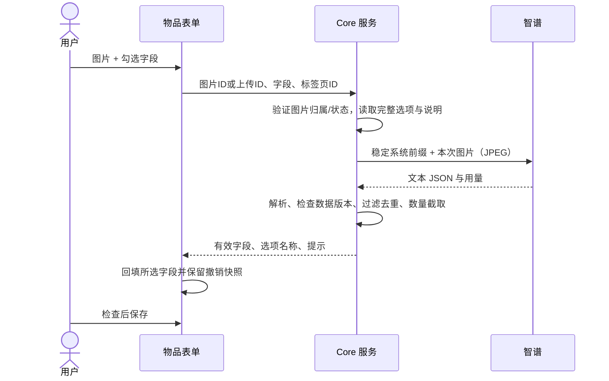

# 物品 AI 识别

## 使用

1. 设置 → AI 识别：模型默认 `glm-4.6v-flash`，填写智谱 API Key 并保存。
   可先点击「测试连接」：使用当前模型和新输入的 Key，Key 留空时使用已保存的 Key。发送系统生成的 64×64 JPEG 测试图片并调用一次模型，验证鉴权、模型图片接口及有效响应；不发送物品图片或选项、不保存配置、不计入识别上下文次数。显示结果与耗时，最多等待上游 30 秒。测试成功后，新配置仍需保存。
2. 分类与标签：分别配置分类、规格、标签的选择说明（各最多 300 字）；选项的新建、编辑弹窗可填写最多 30 字说明，均允许为空。物品表单快捷创建标签和规格时说明为空。
   每个选项还可填写「示例物品」，每行一条，最多 10 条，每条 100 字，允许留空；空行和重复项自动忽略。例如「短袖」可填写「短袖T恤」「短袖连衣裙」「短袖外套」。仅菜单的新建、编辑弹窗提供维护入口，快捷创建默认示例为空。
3. 创建或编辑物品，添加图片后点击图片板块下的「AI识别」。选择名称、分类、规格、标签中的一个或多个字段；默认全选，也可在设置中修改当前设备的默认勾选项。
   在默认勾选项下可设置「物品名称补充提示词」（最多 300 字），例如名称格式、措辞要求，点击「保存名称提示词」后生效。提示词保存在服务端，仅在本次勾选物品名称时发送；留空使用默认命名规则。
4. 确认后回填勾选字段；检查后使用原有保存按钮保存。可以撤销最近一次填充。袋子、箱子、仓库不提供识别入口。

## 回填规则

- 图片最多 5 张。上传中、处理失败或没有图片时不发起识别。
- 分类最多 3 个；规格、标签遵循现有表单限制，目前没有数量上限。
- 要求模型按匹配程度排序，服务端依次过滤无效 ID、去重、截取前 N 个。不自动创建候选项。
- 三类选项均按多选判断，要求检查全部候选并返回所有可靠匹配、不冲突且符合选择说明的选项，提示词附多选数组示例。分类同一路径选最具体项、不同路径可同时匹配；规格和标签可覆盖不同属性维度，不强行凑数量。
- 用户配置的选择说明优先于默认选择策略，仍受输出格式、有效候选和分类 3 个硬上限约束。分类候选附完整 `path` 与祖先名称、说明 `ancestors`，明确将父分类对子类的要求用于子类；用户要求的必选分组优先占用名额，再补充物品类型等其他适用分类。无法判断时仍不编造结果。
- 每个候选的 `examples` 数组随说明发送给 AI，用于理解适用物品，不作为穷举白名单或替代图片证据。示例修改参与数据版本计算，后续请求重建上下文，识别期间修改则拒绝回填旧结果。
- `matched` 回填有效值；`unknown` 或字段缺失保留旧值并提示；`none` 仅允许规格、标签清空。名称和分类无有效结果时保留旧值。
- 只替换本次勾选字段。回填不会自动保存档案。
- 非法 JSON、截断响应、鉴权或网络异常不回填。正在识别时锁定基本信息、图片和保存；取消或离开页面后的结果不再回填。
- 规格由服务端读取完整表，不受前端分页、搜索或最近使用排序影响。返回已选项的名称以避免尚未加载的规格显示为 ID。

## 上下文复用的实际边界

使用智谱标准 Chat Completions：`https://open.bigmodel.cn/api/paas/v4/chat/completions`。

采用独立识别和稳定前缀复用，不保存其他物品的历史图片及答案。前置数据按用户与浏览器标签页隔离，在服务端内存中复用，最多 10 次请求或 30 分钟；模型设置、选项 ID/名称/说明/分类层级、三类选择说明或系统规则版本变化时重新构建。识别过程中数据变化则拒绝回填旧结果。

**这不是供应商托管的连续对话。**该接口每次仍需发送系统前缀；智谱的隐式缓存由供应商决定是否命中，不能保证省去传输、缓存命中或费用。每次返回的 `usage.cachedTokens` 直接取自上游，缺失时为 `null`。轮换本地上下文不添加随机内容到前缀，避免破坏缓存。

图片转为不超过 2048×2048 的 JPEG，以 Base64 发送。关闭深度思考，输出上限 4096 tokens，超时 90 秒。视觉模型不发送仅供文本模型使用的 `response_format`，通过明确 JSON 提示和本地结构校验约束输出；不自动重试收费请求。

`glm-4v-flash` 与 `glm-4.6v-flash` 是不同模型。旧的 `glm-4v-flash` 仅支持公网图片 URL、单张图片，并且输出上限 1024 tokens，无法用于当前本地图片的 Base64 上传流程；识别与测试连接会在本地明确提示不兼容，不发送上游请求。来源：[智谱官方视觉工具的模型限制](https://github.com/zai-org/GLM-V/blob/main/skills/glmv-caption/scripts/glmv_caption.py)。

## 存储与接口

- 数据库 schema 7：三类选项增加 `description` 和 JSON 数组 `examples`（已有选项自动迁移为空列表）；新增 `ai_settings` 和 `ai_selection_rules`。支持既有数据迁移以及开发阶段 50 字说明升级到 300 字，名称补充提示词 `name_prompt` 自动迁移且默认为空。
- Key 用 AES-256-GCM 加密后保存，密钥由当前服务的 session secret 派生。备份、迁移时应同时保留该服务密钥；若更换服务密钥，需要重新填写 AI Key。接口只返回是否配置，不回传 Key，日志不输出上游响应或识别图片。
- `GET/PUT /api/v1/settings/ai`：模型、名称补充提示词 `namePrompt` 和 Key；写入携带 `expectedVersion`，省略名称提示词保留旧值、传空字符串清空；省略 Key 保留旧值，`clearApiKey` 删除。修改提示词会更新设置版本并重建识别上下文。
- `POST /api/v1/settings/ai/test`：`model`、可选 `apiKey`、`expectedVersion`。空 Key 使用已保存 Key并检查配置版本；返回 `model` 和 `elapsedMs`，不返回 Key 或上游内容。与识别共用单用户并发限制，无自动重试。
- 上游失败只返回 HTTP 状态、数字错误码和长度受限的脱敏错误说明，不返回原始响应；Key、图片数据和 URL 会隐藏，以便区分参数、模型权限及额度错误。
- `GET/PUT /api/v1/ai/selection-rules`：三类选择说明；写入携带 `expectedVersion`。
- `POST /api/v1/ai/recognize`：`fields`、`images`、`clientId`。图片为 `{imageId}` 或 `{uploadId}`。未保存的上传仅允许所属用户使用。沿用系统登录与 CSRF 校验。
- 默认勾选项仅保存于浏览器 localStorage，API Key 不进入前端持久化存储。

## 验证边界

已通过 TypeScript 检查、构建和隔离数据库/模拟上游的验证。真实 GLM-4.6V-Flash 输出质量、账户权限和缓存命中需要用户配置真实 API Key 后确认。

参考：[快速开始](https://docs.bigmodel.cn/cn/api/introduction)、[对话补全](https://docs.bigmodel.cn/api-reference/模型-api/对话补全)、[上下文缓存](https://docs.bigmodel.cn/cn/guide/capabilities/cache)。
