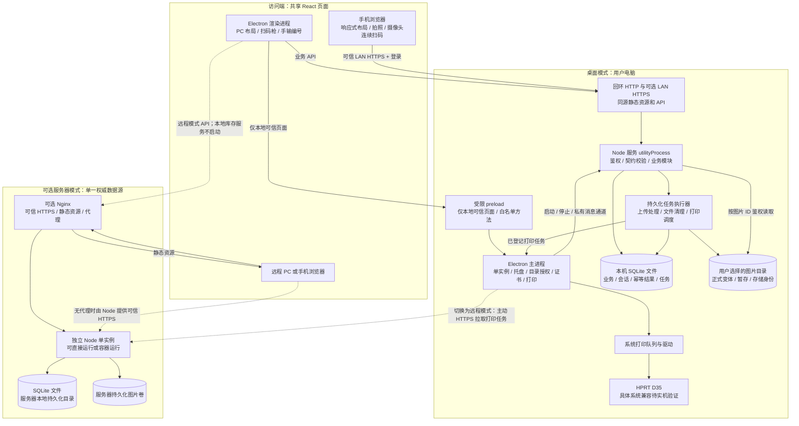
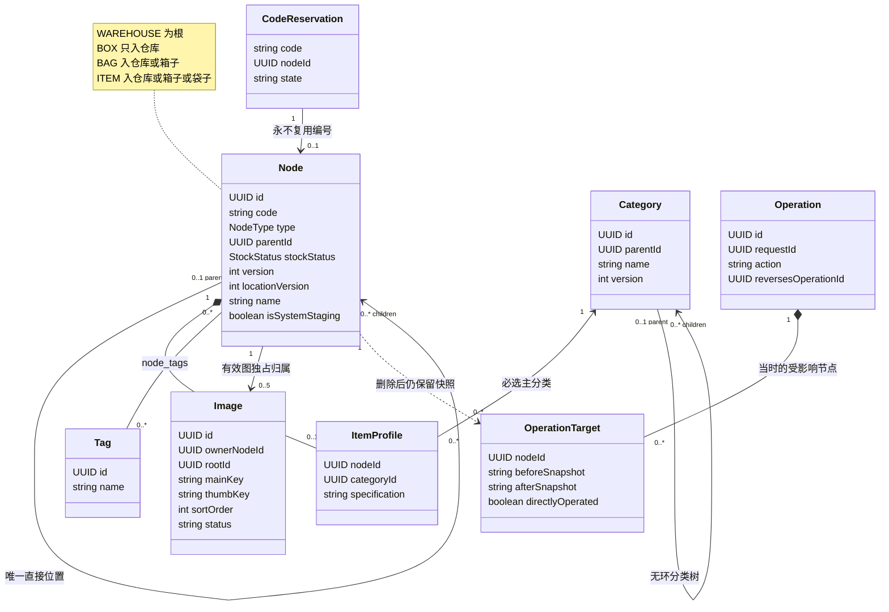
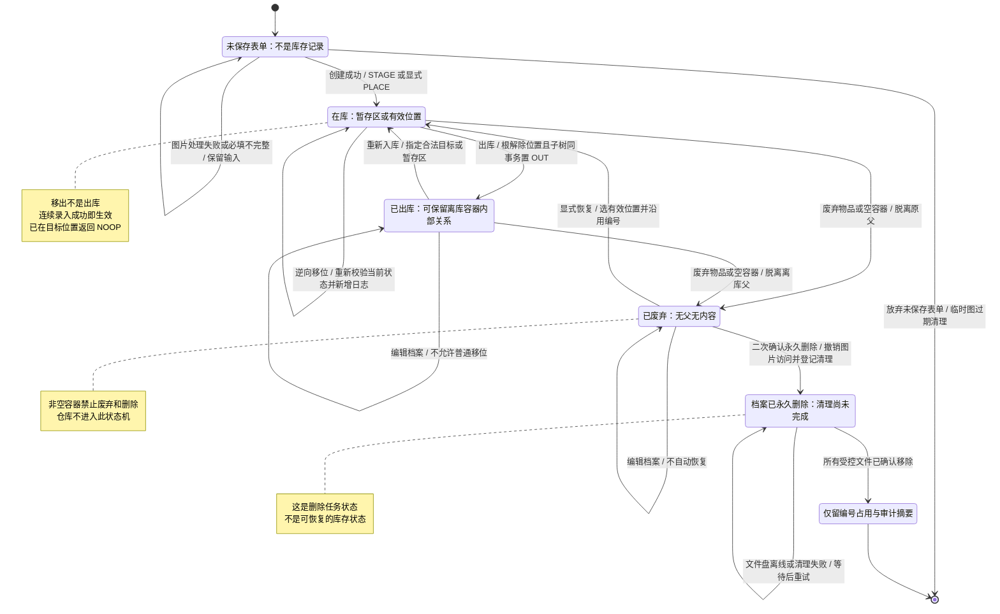
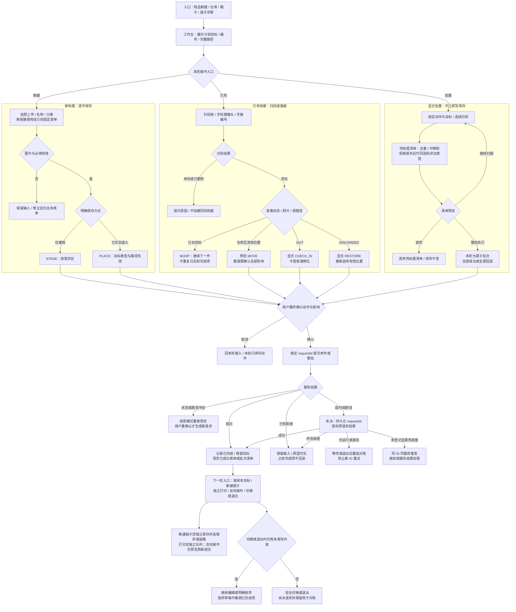
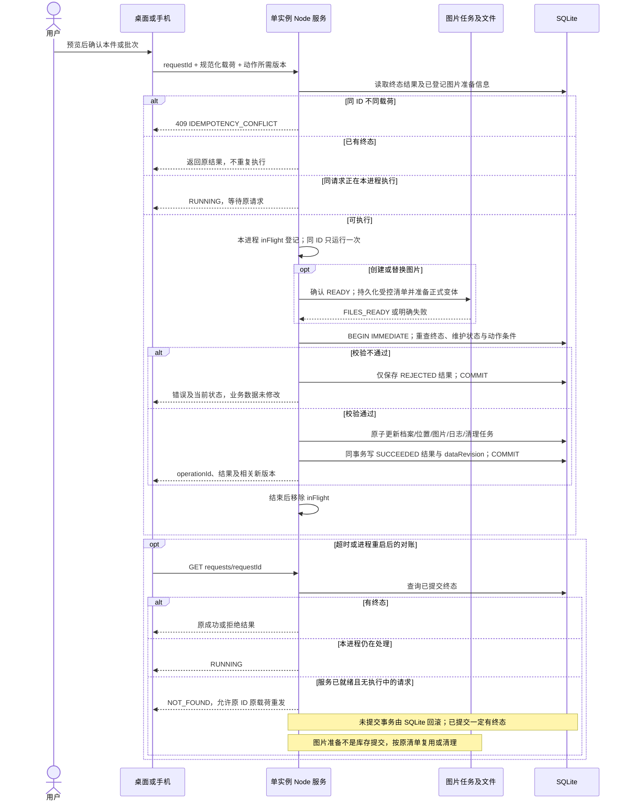
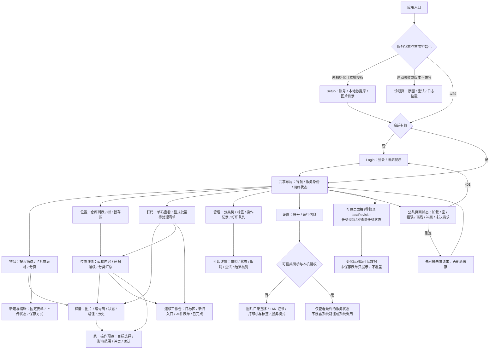
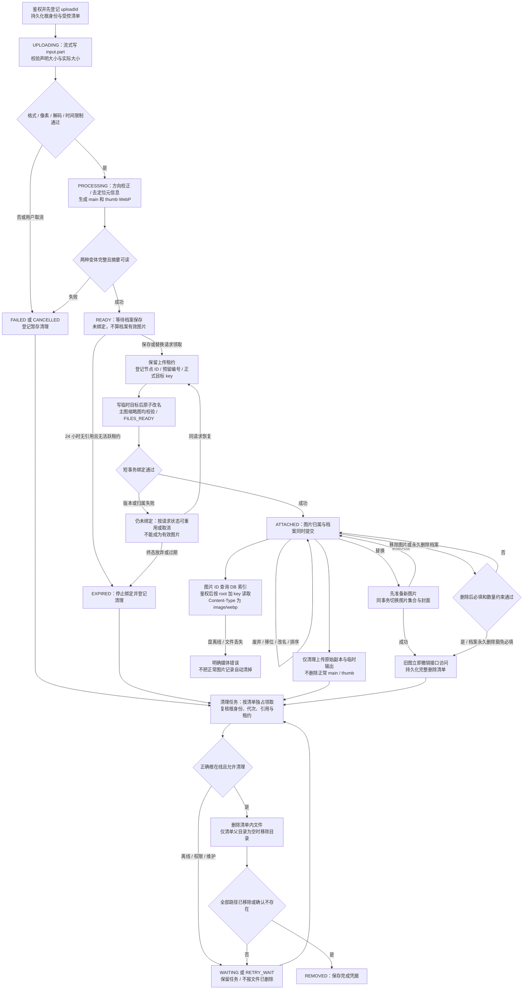
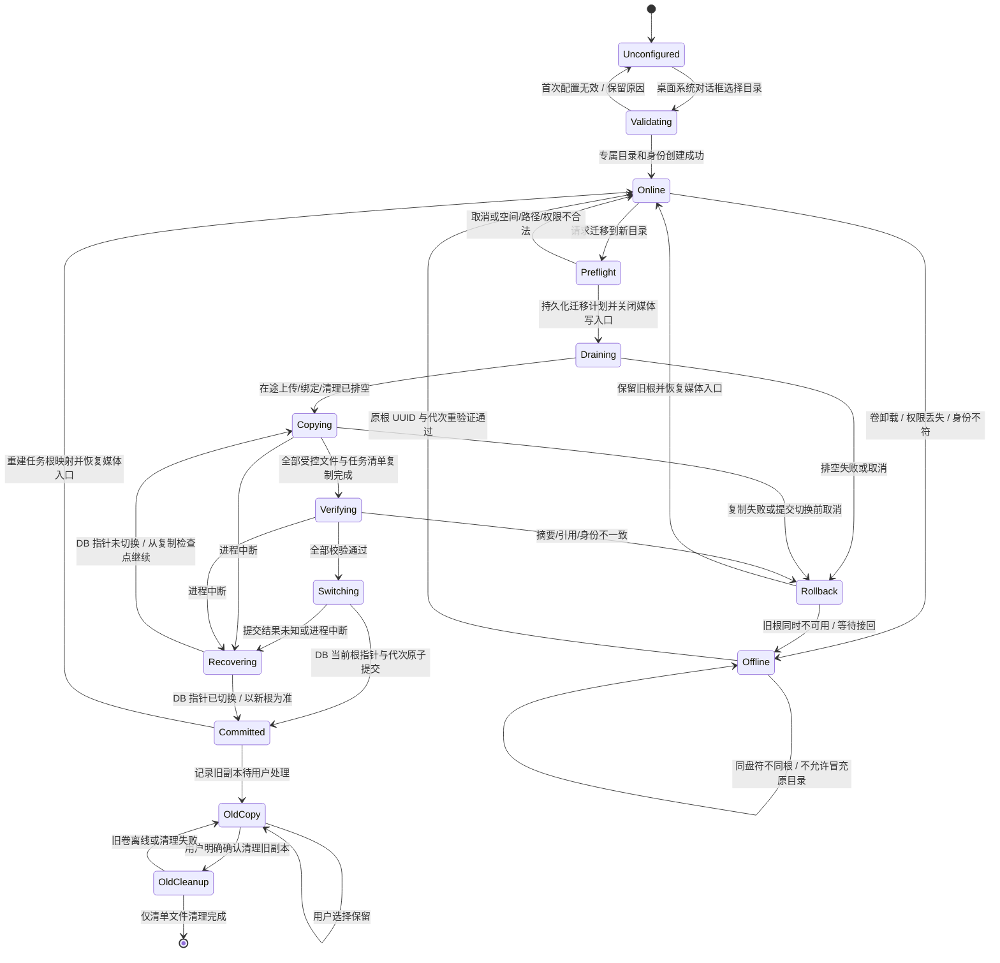
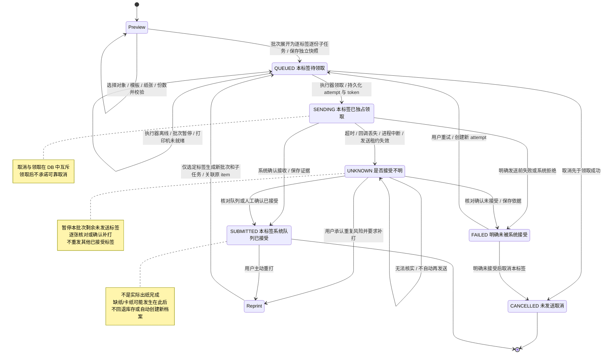
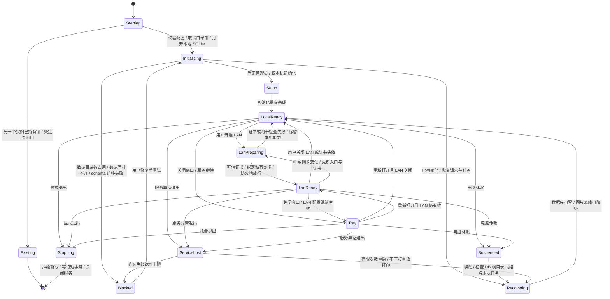

# Inventory Hub 完整开发文档

版本：1.1（技术方案审查修订：SQLite 单机服务） · 更新：2026-09-05

本文是项目唯一开发文档。图、字段、接口、异常处理和验收条目共同构成契约；不是已经实现的软件说明。仓库当前没有业务代码，文中目录、接口和命令均为待实现目标。后续修改需求时同步修改本文件，不能只修改图或代码中的一方。

## 1. 范围、决策与阅读顺序

### 1.1 产品边界

通用的单件物品管理软件。每件物品数量固定为 1、独立编号；通过仓库、箱子、袋子管理实际位置。一个用户可同时使用电脑与局域网手机网页，因此必须处理并发操作，不能用“单用户”代替事务和冲突检查。

必须交付：建档、固定属性、分类标签、多图、唯一编号与条形码、混合收纳、递归查询、逐件连续录入、显式批量操作、出入库、移位、废弃恢复、永久删除、完整操作记录、电脑打印、手机摄像头扫码、登录、图片目录选择与清理、Windows/macOS 桌面包、独立服务器部署入口。

不交付：SKU 数量库存、价格订单、采购销售、导入、备份功能、动态字段配置器、多用户权限体系、原生手机 App、手机离线写入、双向同步、独立图床、定制 Apple 风格。

### 1.2 实现基线与外部验证条件

| 项目 | 本文采用的基线 | 不能暗中改变的边界 |
|---|---|---|
| 客户端 | Electron + React + TypeScript + shadcn/ui；同一前端适配 PC/手机 | 手机不运行 Electron；屏幕尺寸不代表系统权限 |
| 服务端 | Node.js + Fastify，独立业务包；桌面模式内置启动 | 不把数据库、图片和库存逻辑写进渲染进程 |
| 数据库 | **SQLite + Drizzle ORM + better-sqlite3**，数据库在服务所在机器的本地磁盘 | 不同时实现另一种数据库；手机只访问 API，不直接打开数据库文件 |
| 桌面部署 | 安装包内含前端、Node 服务和数据库驱动；首次启动创建数据库 | 不要求用户安装 Node.js、Docker、Nginx 或数据库服务；硬件驱动与手机证书信任仍需配置 |
| Nginx / Docker | 仅为服务器部署选项；可独立 Node 运行，也可用 Node 容器加 Nginx | 桌面内置服务提供静态资源和 LAN HTTPS，不运行数据库容器 |
| 服务器能力 | 本文给出独立启动、持久化卷、代理、远程打印接入契约 | 可分阶段实现，但不能未经确认从最终范围删除 |
| 固定字段与删除策略 | 按本文的固定字段、先废弃再永久删除、恢复选位置执行 | 属于本轮审计基线；与需求修改有关时先修订本文 |

数据库依据独立桌面软件、单用户与低写入并发选择，不再把早期部署讨论中的 MySQL 当作硬性要求。桌面与服务器都复用 SQLite 实现；服务器首次按单实例运行，未来出现高写入并发或多实例需求时再评估数据库迁移。[SQLite 官方适用场景](https://www.sqlite.org/whentouse.html)

P0 即需取得并验证：实际 Windows/macOS 版本与架构、D35 连接方式和可用驱动、标签宽高与间隙/黑标、手机系统/浏览器、局域网证书信任流程。先用最小安装包验证数据库读写、Sharp 压缩、手机拍照/相册上传和连续扫码，不等主要业务完成后才验证。图片参数采用第 9 节默认值，实拍效果不达标时修订，不承诺任意输入都能处理。

### 1.3 文档导航与原图覆盖

| 原图主题 | 合并后的主要章节 |
|---|---|
| 01 系统架构 + 04 运行部署 | 第 2 节统一组件/部署图、第 12 节运行生命周期 |
| 02 库存状态 + 08 位置关系 | 第 3 节模型、第 4 节正逆向状态与操作矩阵 |
| 03 页面结构 | 第 7 节路由、页面组成、交互状态 |
| 05 扫码批量 + 07 连续建档 | 第 5 节统一工作流、第 6 节事务与结果恢复 |
| 06 打印 | 第 11 节任务状态及异常恢复 |
| 09 图片存储 + 10 图片生命周期 | 第 9 节合并存储/处理/访问/清理、第 10 节迁移恢复 |

先读 3～6 节审计业务，再读 7～11 节对照前后端实现，最后按 13～15 节发布验收。图按职责合并，不为凑原图数量重复画同一过程。

## 2. 技术栈、模块与部署架构



虚线是互斥部署模式的接入能力，不是本地数据库与服务器数据库同步。一次只连接一个权威服务；切换模式清空客户端业务缓存、退出原会话，并明确显示当前服务名称。手机访问桌面模式时，数据存电脑；访问服务器模式时，数据存服务器，不再承诺在电脑目录中保存一份。

> ***“utilityProcess / 受限进程消息通道”***
>
> *把 Node 服务作为桌面软件管理的独立工作进程；页面不能直接访问电脑，只能通过列出的少量接口请求主进程完成系统操作。*

### 2.1 依赖选择与职责

| 层 | 选型 | 具体边界 |
|---|---|---|
| 前端 | React、TypeScript、Vite、React Router | 一份路由与领域表单；PC/手机布局适配 |
| UI | shadcn/ui、Tailwind CSS、Lucide | 默认风格；Dialog/Sheet、表格/卡片按布局切换 |
| 数据与表单 | TanStack Query、React Hook Form、Zod | 服务器数据不复制进全局状态；Zod 契约共享 |
| 后端 | Node.js、Fastify、Drizzle ORM、better-sqlite3 | HTTP 适配器与业务解耦；单服务拥有 SQLite 连接，短事务同步执行 |
| 图片 | Sharp | 隔离处理工作进程，限制内存与并发；显式 WebP 输出 |
| 扫码/标签 | @zxing/browser、JsBarcode Code 128 | 浏览器实时识别与标签生成；不承担 USB 驱动功能 |
| 桌面/发行 | Electron、Electron Forge、pnpm workspace | 主进程只管理系统能力，按 OS/架构构建 |
| 服务部署 | 独立 Node + SQLite；可选 Docker Compose、Nginx | 单实例起步；不共享网络数据库文件，无需 Redis 或消息中间件 |

上述是选型，不是依赖已安装声明。初始化时锁定受支持且互相兼容的确切版本，提交 lockfile；安装和发布不使用浮动 `latest`。Electron 自带 Node 与独立服务 Node 的兼容版本、better-sqlite3 和 Sharp 的平台二进制必须在 P0 最小安装包中确认；开发机能运行不能替代安装包验证。[Electron 原生模块说明](https://www.electronjs.org/docs/latest/tutorial/using-native-node-modules)

### 2.2 目标代码结构

```text
apps/desktop/              主进程、preload、打印执行器、平台适配、打包配置
apps/web/                  路由、页面、业务组件、响应式布局
apps/server/               独立服务入口、配置加载、健康检查、信号退出
packages/contracts/        Zod 请求/响应、错误码、枚举；不得依赖 Electron
packages/core/src/domain/  库存与位置规则、操作用例；不导入 UI/驱动
packages/core/src/db/      SQLite schema、迁移、仓储、短事务
packages/core/src/http/    Fastify 路由、认证、请求去重
packages/core/src/media/   图片处理、目录校验、文件清理与恢复
packages/core/src/print/   模板、批次/标签子任务、发送结果
deploy/                    Compose、Nginx、环境变量示例
docs/development.md        唯一开发文档
```

首版只有 contracts 和 core 两个共享包，core 内按模块分目录，不给每个模块单独建包。调用方向为入口 → HTTP/用例 → domain/db/media/print；domain 不反向依赖 Fastify/Electron。只有 Node 服务持有 SQLite 连接，后台任务通过该服务提交短事务；图片工作进程、渲染进程和主进程不直接连接数据库。前端不得提交 SQL、本地绝对路径、原始打印命令或任意脚本。

## 3. 编号、档案与唯一位置模型

### 3.1 核心模型



分类树不是位置树；标签不是多个实际位置。某物品展示“属于袋子、箱子、仓库”表示同一条祖先链，不是三条独立分组关联。

### 3.2 类型、父子规则与编号

| 对象 | 编号 | 在库时允许的直接父节点 | 允许直接内容 | 状态 |
|---|---|---|---|---|
| WAREHOUSE 仓库 | `W000001` 起 | 无，必须为根 | BOX、BAG、ITEM 混合 | 不使用库存状态，`stockStatus=null` |
| BOX 箱子 | `C000001` 起 | WAREHOUSE | BAG、ITEM 混合 | IN_STOCK / OUT / DISCARDED |
| BAG 袋子 | 与 BOX 共用 C 号段 | WAREHOUSE、BOX | ITEM，一件或多件 | 同上 |
| ITEM 物品 | `I000001` 起 | WAREHOUSE、BOX、BAG | 无 | 同上 |

编号内部不编码分类、位置、日期；迁移、改名、出入库都不换号。数字至少六位，超出自动增长，不截断。生成在 SQLite 短写事务内更新 `code_sequences`，占号后即进入 `code_reservations`，允许空号；失败、废弃、永久删除都不回收。箱袋类型创建后不允许转换。

内部主键统一 UUID，API 按 ID 写操作，条码只保存人可读编号。扫码输入仅 trim、转大写，再匹配 `^(W|C|I)[0-9]{6,}$`；不把任意 URL 或脚本当码执行。Code 128 内容与打印的编号文本一致。袋子即使只放一件物品也打印自己的 C 码。

### 3.3 暂存区与位置推导

- 初始化同一事务创建唯一系统仓库“暂存区”，并保存 `system_settings.stagingNodeId`；有稳定 W 码，禁止删除、改类型和取消系统标记。显示名固定，图片/备注可维护。
- 未明确位置的新物品、袋子、箱子直接放暂存区。不创建默认箱子/袋子，也不将“未分类”当作库存状态。
- 持久化只存 `parentId`。`warehouseId`、`boxId`、`bagId`、面包屑是读取结果，不能在 PATCH 中独立写入。
- 整袋/整箱移位只改根容器 `parentId`；后代不重写位置、不搬图片。整棵子树仍需记录影响范围。
- 在库非仓库节点必须经有效祖先链到仓库；OUT 子树根 `parentId=null`，内部父子关系保留，所有非仓库后代均 OUT；DISCARDED 节点必须没有父节点且无内容。
- 在库节点不能挂在 OUT/DISCARDED 容器下。一个 OUT 节点可为 OUT 子树的后代；单独重新入库时从旧 OUT 父容器摘除，余下子树保持 OUT。
- 仓库树只显示实际库存；出库列表可展开仍保留的离库容器结构。离库对象展示“当前离库”与“最后在库位置”两个字段，不能把历史仓库显示成当前位置。

### 3.4 固定字段与分类标签

| 字段 | 物品 | 袋子 / 箱子 | 仓库 | 约束 |
|---|---|---|---|---|
| name | 必填 | 必填 | 必填 | trim 后 1～120 字符；可重名，用编号区分 |
| categoryId | 必填 | 不手填 | 不手填 | 一个有效主分类；选任一级，父类筛选包括后代 |
| images | 1～5 张 | 0～5 张 | 0～5 张 | 仅有效已处理图片；第一张为封面，无单独可冲突封面字段 |
| specification | 可选 | 无 | 无 | 单一文本，最多 500 字符，不做动态键值属性 |
| tagIds | 0～20 个 | 0～20 个 | 0～20 个 | 去重后的有效标签 ID |
| notes | 可选 | 可选 | 可选 | 最多 2000 字符，纯文本展示 |
| parent / status | 由保存模式与库存动作维护 | 同左 | 父与状态固定为空 | 编辑档案接口不能修改 |

分类最多 5 层，同父名称规范化后唯一，移动不能形成环。标签名称全局规范化后唯一。规范化为 Unicode NFC + trim + 不区分大小写，保留原始展示名。分类有引用时删除返回冲突，可先选择目标分类迁移其**直接引用**物品；有子分类时必须先处理子类，不能静默级联。迁移不改变后代分类归属；标签删除需预览引用数，确认后解除关联并记录日志。

容器和仓库的“内容分类”由当前子树中物品的主分类汇总，统计去重物品数量，不把箱子、袋子作为物品计数；空容器显示空集合。标签属于各档案自身，不隐式继承。查询历史分类需读取操作快照，不用当前分类反推历史。

## 4. 库存正向、逆向与禁止操作



### 4.1 动作契约

| 动作 | 前置状态与对象 | 写入与影响范围 | 逆向 / 异常 |
|---|---|---|---|
| CREATE | 新档案，表单及图片有效 | 创建节点与档案；STAGE→暂存区；PLACE→明确目标；CREATE 日志 | 没有“撤回创建”直接消失；误建后废弃、永久删除 |
| MOVE | 在库物品或容器，目标符合父类型 | 改根父；保存影响子树路径；根 locationVersion 增加 | 目标与当前相同为 NOOP；逆向也是新 MOVE，不删除历史 |
| REMOVE | 同 MOVE，不指定目标时回暂存区 | 服务端归一为 MOVE，记录原因 REMOVE | 不更改 IN_STOCK；可以再次装入 |
| CHECK_OUT | 在库物品或整个容器 | 根 parent=null；选中子树所有非仓库节点置 OUT，locationVersion 增加 | 不能只改箱状态而留在库子项；逆向用 CHECK_IN |
| CHECK_IN | OUT 物品或容器，子树状态一致 | 从离库父摘除，根放目标，整个选中子树 IN_STOCK | 可从离库箱中单独取袋/物品入库；剩余仍 OUT |
| DISCARD | ITEM 或空 BOX/BAG，IN_STOCK/OUT | parent=null，DISCARDED，保留图片、编号、档案 | 非空容器冲突；逆向 RESTORE |
| RESTORE | DISCARDED | IN_STOCK，显式新位置；未指定即暂存区 | 不自动恢复历史位置或历史 OUT 状态 |
| HARD_DELETE | DISCARDED 且无内容 | 删除有效档案及关联，保留墓碑与审计，文件待清理 | 不可撤销；不能从正常在库直接删除 |
| DELETE_WAREHOUSE | 普通空仓库 | 删除仓库档案、图片待清理、编号保留 | 暂存区或有内容时拒绝；不可恢复 |
| EDIT_PROFILE | 未永久删除的节点 | 修改固定字段/图片/标签，version+1，记录摘要 | 不能顺便修改位置、类型、编号；再次编辑即逆向 |

> ***“墓碑记录”***
>
> *档案删掉后留下的最小凭据，类似已注销编号的登记条；它阻止旧编号复用，也让历史记录仍能解释发生过什么，但不能恢复被删档案或图片。*

### 4.2 撤销不是数据库回滚

已提交动作一律通过**新请求、新操作记录**补偿。界面“撤销本次移位”先调预览，再按 MOVE 提交并关联 `reversesOperationId`。必须核对原操作 after 快照与当前根位置版本、受影响子树成员和路径；发现增减内容、状态或位置改变，拒绝一键撤销，提示按当前实际情况重新移动。仅名称、备注、分类或图片变化不阻止逆向移位，预览使用最新档案信息。

出库的反向为重新入库；废弃的反向为恢复。旧父节点被删、离库或不合法时，不自动放回，也不静默改暂存区；要求用户重新选位置，作为普通反向动作确认。批量撤销按原批次整体预览和整批事务，任意项变化则拒绝一键撤销，可退出后逐项手工处理。打印、永久删除不支持库存撤销。

### 4.3 整体与局部的边界

整箱移动/出库前显示直接对象数、递归物品数、路径和受影响编号；只把用户选中的根记为直接操作，其后代记为继承影响。即使某物品后来移出该箱，仍能查询之前箱子移动对它的影响。

批次不允许同时选择祖先与后代；单次最多 100 个直接目标、展开后最多 5000 个节点。超限预览拒绝并要求分批，不静默拆分已经承诺原子的整箱操作。仓库不支持出入库、整仓废弃或级联删除；清空仓库使用显式批量移位。

## 5. 连续建档、混合装入与扫码工作台

### 5.1 合并交互流程



图中冲突后的确认必须保留原模式：逐件重新确认本件，批量重新预览整批，不能降级成逐项偷偷提交。切换目标需先处理当前草稿；仅改变工作台上下文不会改库存。服务持续离线时允许退出页面，但必须保留未决 requestId 与载荷摘要，下次连接先对账；退出页面不是取消服务端事务。

### 5.2 必须覆盖的组合场景

| 场景 | 可执行步骤 | 完成定义 |
|---|---|---|
| 先建档后决定收纳 | 新物品仅保存→暂存区→创建袋子→确认物品装袋→确认袋子装箱 | 每一步独立生效；装袋后物品不会自动脱袋 |
| 先定箱子，但仓库未定 | 新建箱子仅暂存→进入箱工作台→新建物品并装箱 | 物品祖先为箱子→暂存区；以后只需移动箱子 |
| 先选袋子连续新建 | 袋子工作台→新物品表单→保存并装入→下一件 | 每件成功即在袋内；袋内可一件或多件 |
| 新旧物品交替 | 同一工作台切换“拍照建档 / 已有档案” | 已有档案不占新号、不重复建档 |
| 已在某箱内的袋子 | 从箱详情进入该袋工作台→连续装入 | 物品只存袋子 parent；不再要求选箱和仓库 |
| 箱内混装 | 箱工作台装入散件→再装入已有整袋 | 直接内容显示散件和袋，递归显示袋内物品 |
| 扫到其他箱子的袋子 | 显示原箱与袋内数量→确认“整袋移入” | 不自动切换工作台目标、不重建袋子 |
| 计划目标与实际未装入 | 已选箱子→点击“仅保存档案” | 必须仍在暂存区；按钮不能暗中执行 PLACE |
| 完成后取出 | 明确“移出到暂存区”或选择新位置 | 保持在库，记录 MOVE，而非 CHECK_OUT |

### 5.3 工作台数据与扫码适配

前端仅保留 `mode、targetId、targetPathToken、action、draft、pendingItems、completedOperations、unresolvedRequest`。`pendingItems` 只用于显式批量；`completedOperations` 只收已成功持久化结果。目标的照片/编号/路径始终可见，并标明“计划目标”。新建袋子弹窗是独立表单，不能复用物品草稿的上传 ID。

成功后清空本件名称、规格、备注、图片、标签，不默认复制上一件内容；可保留用户明确开启的“沿用分类”。失败保留输入；草稿放弃立即取消未提交上传，后台兜底过期清理。不承诺跨重启恢复未保存表单，未决请求 ID 则必须持久化到客户端并在下次连接时对账。

扫码枪只在扫码专用输入框采集结束符，不全局劫持普通键盘；桌面不提供摄像头扫码入口。手机使用后置摄像头、显式开始/暂停；离开页面、切换摄像头、进入后台时释放视频流。连续识别对同码设置 1500ms 抑制窗口，再按当前清单 ID 去重；逐件模式显示确认卡期间暂停识别，成功/取消后才继续，防止新码覆盖未确认对象。

手机无权限、无摄像头、被占用、非可信 HTTPS 分别给出明确提示；可手输编号，不把上传静态照片识码当作已经实现的实时扫描。拍照建档使用图片输入入口，与实时视频扫码权限分开处理。

## 6. 事务、版本、幂等与操作历史

### 6.1 一次写入的完整时序



> ***“幂等”***
>
> *同一张操作单重复送达仍只办理一次。网络超时后查询原单据，而不是另开一张可能重复执行的单据。*

### 6.2 SQLite 事务与动作版本

每个数据目录只允许一个 Node 服务实例；桌面和独立服务入口均在打开数据库前取得操作系统级数据目录独占锁，退出时释放。不能只通过检查 PID 或文件是否存在判断占用。数据库位于本地磁盘，不放 SMB/NFS 共享目录；手机、图片工作进程和 Electron 主进程都不打开数据库。

启动连接显式启用 `foreign_keys=ON、journal_mode=WAL、synchronous=FULL、busy_timeout=3000`，验证实际生效。只有服务持有一个业务连接，写用例使用 `BEGIN IMMEDIATE` 短事务；同事务完成条件重验、变更、审计和请求结果。事务回调不允许 await，不包含图片压缩、磁盘复制、打印和网络调用。后台任务也回到此服务提交数据库更新。[SQLite WAL 说明](https://www.sqlite.org/wal.html)

锁定驱动时同时记录 SELECT sqlite_version() 的实际内嵌 SQLite 版本，采用 3.51.3 或更高且已修复已知 WAL-reset 问题的版本；不能只看 better-sqlite3 的 npm 版本或系统 sqlite 命令版本。单连接设计不能代替依赖版本检查。[SQLite WAL 修复说明](https://www.sqlite.org/wal.html#walresetbug)

首版不使用数据库连接池、行级锁表、跨执行器请求租约或通用请求接管协议。文件任务仍保留专用状态、运行标识和清单：取消/重启必须先确认旧工作进程已停止，再允许清理或重做；运行标识防止迟到回报覆盖新任务。远程打印保留领取与回报校验，不能因精简普通请求而删除设备安全边界。

节点有两种版本，初始均为 1：

- `version`：档案名称、分类、规格、标签、备注、图片变化后增加；用于编辑档案及图片集合的 expectedVersion。
- `locationVersion`：直接父节点或库存状态变化后增加；用于 MOVE/CHECK_OUT/CHECK_IN/DISCARD/RESTORE 的 expectedLocationVersion。整箱移动只增加箱子的这一版本；子物品路径变化通过祖先令牌检测。
- `locationToken`：对“节点到根的有序 ID、parentId、locationVersion、stockStatus”计算 SHA-256；不得包含名称、备注、图片或档案 version。
- `subtreeToken`：对选中子树有序 ID、parentId、locationVersion、stockStatus 计算 SHA-256；捕获内容增减、状态与位置变化，不因无关的档案编辑失效。
- `treeToken`：递归分页使用相同的结构状态信息生成；档案显示字段可按最新值刷新，拓扑变化则要求重载分页。

事务内重算源、目标和子树令牌。库存动作只比较位置版本；永久删除同时比较档案版本与位置版本，避免删除用户刚编辑的档案。改名后用最新名称展示预览/结果，但不会以“位置冲突”阻止移动。这些令牌只检测过期，不代替鉴权。

写锁等待超时返回 DATABASE_BUSY，保留原 requestId；先查终态，再允许同 ID 同载荷重发。未知提交结果不得直接执行第二次写入。所有数据库调用须有计时，长查询或大批次达到约束时拒绝/优化，不能让同步数据库调用长期阻塞 HTTP 服务。

### 6.3 请求结果与任务边界

普通业务写请求带 UUID requestId（Idempotency-Key），绑定账号、方法、规范化路径与载荷 hash。数据库 request_results **只存 SUCCEEDED / REJECTED 终态**；RUNNING 由本进程 inFlight 映射提供，不是持久化库存任务。先拒绝鉴权/结构错误，再登记 inFlight；相同 ID 不同载荷始终返回 409。

事务校验拒绝时只保存 REJECTED；SQL 执行异常时回滚整个业务事务，能够确认未提交且数据库可用后才另记明确拒绝；数据库不可用或提交结果不明时返回服务错误，不伪造终态。SQLite 原子提交保证业务成功时同一事务已有 SUCCEEDED。进程崩溃后没有普通请求租约需要抢占，也不自动凭不完整客户端草稿创建物品。

图片准备会跨数据库与文件系统：编号预留和上传清单必须记录 requestId、userId、payloadHash、预留节点 ID 与文件路径。相同请求重发先检查这些信息，复用已准备文件；即使还没有 request_results，换载荷也要拒绝。若用户放弃，请求的准备信息不能立即抹掉去重依据；保留最小 hash 及 EXPIRED 标记，旧请求返回 REQUEST_PREPARATION_EXPIRED，重新建档须用户确认新请求。

取消只适用于未提交表单、上传或尚未发送的打印子任务；不提供普通库存请求的 cancel API。UI 发出业务请求后只能等待/对账，成功后通过新业务动作逆向处理。REJECTED 后修改内容并重新确认属于新操作，可生成新 ID；超时未知时不适用此规则。

终态保留最小去重记录直到数据集销毁；大结果可存稳定结果引用，但必须能还原创建的节点 ID、operationId 与状态。GET requests 返回终态、RUNNING，或无执行实例时的 NOT_FOUND；NOT_FOUND 允许同 ID 同载荷重发，不代表图片准备文件不存在。图片处理、清理、目录迁移与打印是有限种持久化任务，不把每个 HTTP 请求变成后台队列。

### 6.4 审计结构与查询

每个实际改变档案/库存/分类标签的成功请求生成一条 operation；显式批次含多个根，每个直接/间接受影响节点生成 operation_target，包含当时名称、编号、类型、父链、状态、版本、改动字段及 `directlyOperated`。不在快照中复制图片二进制、密码或绝对路径；图片用 ID 和增删摘要。日志与业务同事务，不依赖进程内事件最终补写。上传、认证、打印有各自任务/安全记录，不伪造库存操作。

分类、标签维护也写 operation，另在日志保存 `subjectType、subjectId、beforeSnapshot、afterSnapshot`；没有受影响节点时允许零条 operation_target，不伪造物品节点。迁移分类引用或删除标签关联时，受影响节点均生成 target 并增加 version。

查询单物品历史用 `operation_targets.node_id`，不按当前祖先关系倒推；整箱移动时每个后代可查到同一操作。NOOP 请求返回成功但 `operationId=null、changed=false`，不制造无意义日志；安全拒绝记录有限诊断日志，不混入成功库存历史。永久删除保留最小历史，UI 对已删除档案显示墓碑而非失效链接。

## 7. 前端页面结构、组件与状态



### 7.1 路由及职责

| 路由 | 查询/操作 | 核心组件与状态 |
|---|---|---|
| `/setup` | 本机一次性初始化 | SQLite 自动创建、账号设置、图片目录授权；失败不开放 LAN |
| `/login` | 账号密码登录 | 错误不泄露账号存在性；禁重复提交；回跳安全站内路径 |
| `/items` | 名称/编号、分类后代、标签、状态、位置、分页 | ItemTable/ItemCard、FilterBar、BatchSelection；区分无数据和无匹配 |
| `/items/new` | STAGE/PLACE 建档 | ItemForm、ImageUploader、CategoryPicker、明确保存按钮 |
| `/items/:id` | 当前档案、码、图片、路径、历史 | Gallery、CodeLabel、LocationBreadcrumb、InventoryActions |
| `/items/:id/edit` | 固定字段与图片集合原子编辑 | 与新建共用校验；编号/状态/位置只读 |
| `/locations` | 仓库及暂存区入口 | LocationTree、类型图标、数量、创建入口 |
| `/locations/new?type=` | 创建普通仓库/箱子/袋子 | ContainerForm；目标限制；系统暂存区不能新建第二个 |
| `/locations/:id` | 直接/递归内容、容器照片、汇总 | MixedContents、层级和路径标识、装入/移出/入库/出库 |
| `/locations/:id/edit` | 名称、标签、备注、图片 | 不允许修改类型；仓库无库存动作 |
| `/intake?targetId=` | 逐件连续新建/装入 | StickyTarget、SourceTabs、CurrentDraft、CompletedList |
| `/scan?mode=lookup\|batch` | 单码查看或显式批量 | ScannerAdapter、CandidateCard、PendingList、BatchPreview |
| `/taxonomy` | 分类/标签维护 | 引用数、删除冲突、迁移直接引用、循环错误 |
| `/operations`、`/operations/:id` | 过滤历史、前后快照、反向操作入口 | OperationTimeline、ImpactList、ReversePreview |
| `/print-jobs`、`/print-jobs/:id` | 打印快照、状态、取消、重试 | 不以 SUBMITTED 显示实际出纸成功 |
| `/settings/account` | 改密、退出其他会话 | 敏感操作要求当前密码；清除缓存 |
| `/settings/storage` | 根状态、迁移、待清理任务 | 仅桌面有操作；离线、迁移失败、清理积压分别展示 |
| `/settings/lan` | 开关、访问地址、证书指引 | 仅桌面；IP 变化后旧地址失效提示 |
| `/settings/devices` | 打印机、模板尺寸、扫码枪结束符 | 仅桌面配置；未知设备不可直接打印 |
| `/settings/about` | 版本、部署模式、服务健康 | 仅桌面展示本机数据/日志路径；网页只读公开状态 |

### 7.2 响应式与交互规则

PC ≥1024px 使用侧栏、表格、工作台左右布局；手机 <768px 使用底部导航、卡片、全屏 Sheet；中间宽度自适应两栏。这是布局默认值，不是权限判断。触控主要操作区至少 44px，手机底部操作栏考虑安全区和软键盘；表单错误定位到字段并保留已传图片。

位置选择器只给出服务端允许的类型，提供搜索、面包屑、暂存区快捷项；过滤掉自身、后代、OUT/DISCARDED 和不合法类型。仍须服务端重验。递归展示默认展开已加载节点，每次最多加载 100 条；“递归”表示覆盖所有后代，不代表一次性无限载入或扁平化丢失父关系。

列表查询用 TanStack Query 保存服务端状态；筛选同步 URL，取消过期查询。写成功失效当前节点、源/目标位置及其祖先计数、相关列表和历史；不能只刷新物品详情而留下错误箱内数量。不对库存写入做未经确认的乐观成功展示。断线显示只读已加载内容，禁写和禁自动离线排队；恢复先处理未决请求再允许再次提交。

双端同步采用轻量轮询，不在首版新增消息中间件。每次档案/库存/分类/标签实际变化，在同一事务增加 system_settings.dataRevision；前台页面每 3s 调 GET /changes?sinceRevision，返回 changed 和最新 dataRevision。变化时重新获取当前可见列表、详情、位置计数及历史；隐藏页面暂停轮询，重新聚焦立即检查。重连先查询未决请求，再刷新数据。该机制是数秒内同步，不承诺毫秒级实时。

轮询不得覆盖未保存表单；仅标记“数据已更新”，保留输入并在提交时校验相应版本。目标路径变化应更新只读提示、使旧预览失效，不能静默将正在录入的目标换掉。图片/打印后台状态在对应任务页每 2s 查询，终态后停止；不为任务心跳增加 dataRevision。不会自动执行断网期间的新库存操作。

图像加载失败区分 401、图片缺失、图片盘离线、格式处理失败；不能用“没有图片”掩盖磁盘故障。图片模态框键盘可关闭、表单有标签、扫码状态有文字反馈，声音只是可选辅助。

## 8. SQLite 数据结构与 HTTP 契约

### 8.1 数据类型与约束通则

数据库使用 SQLite STRICT 表；ID、编号、文本和 JSON 使用 TEXT，版本、计数、布尔及时间使用 INTEGER；布尔值 CHECK 为 0/1。UUID 和规范化编号使用 BINARY 比较及唯一索引；长度通过 CHECK 与契约校验，不依赖 VARCHAR 限长。时间统一 UTC 毫秒整数，接口 ISO 8601 UTC，UI 按本地时区展示。序列递增使用整数并检查溢出；超过 JS 安全范围的序列值以十进制字符串处理。JSON 列加 json_valid CHECK。分类/标签规范化由应用计算，不依赖只覆盖 ASCII 的 NOCASE 完成 Unicode 规则。[SQLite STRICT 表说明](https://www.sqlite.org/stricttables.html)

核心外键默认 RESTRICT，不用位置关系级联删除。统一节点避免自由多态 `ownerType+ownerId`。JSON 只用于不可变快照、任务清单和响应，不把日常筛选字段藏进 JSON。所有 NOT NULL、UNIQUE、CHECK 和外键由迁移定义，类型合法性/跨行计数/树约束由事务内业务校验双重保证。

### 8.2 表与索引

下列除联合主键表外均有 `id、created_at、updated_at`；不可变日志只有 `created_at`。`?` 表示可空。

| 表 | 必须落地的字段 | 关键索引 / 生命周期 |
|---|---|---|
| nodes | code、type、parent_id?、stock_status?、name、notes、version、location_version、is_system_staging | UNIQUE(code)；(parent_id,type,id)；(stock_status,type,id)；父外键 RESTRICT；对 is_system_staging=1 建部分唯一索引保证最多一个暂存区 |
| item_profiles | node_id、category_id、specification | PK(node_id)；FK category RESTRICT；(category_id,node_id)；只允许 ITEM |
| categories | parent_id?、name、normalized_name、parent_scope_key、version | UNIQUE(parent_scope_key,normalized_name)；根使用固定 scope 值避免 NULL 唯一漏洞；(parent_id,id) |
| tags | name、normalized_name、version | UNIQUE(normalized_name) |
| node_tags | node_id、tag_id | PK(node_id,tag_id)；(tag_id,node_id)；删除归属可级联，但标签删除先日志化 |
| code_sequences | prefix、next_value | PK(prefix)；短写事务内取号，W/C/I 三行 |
| code_reservations | code、node_id、user_id、request_id、payload_hash、state | PK(code)、UNIQUE(node_id)、UNIQUE(user_id,request_id)；RESERVED/ACTIVE/DELETED/ABANDONED/EXPIRED，永不回收 |
| node_tombstones | node_id、code、type、deleted_at、operation_id | PK(node_id)、UNIQUE(code)；不存图片路径，不可还原档案 |
| images | owner_node_id、root_id、main_key、thumb_key、mime、main_width/height/bytes、thumb_width/height/bytes、checksums、sort_order、processing_version、status | (owner_node_id,status,sort_order,id)；UNIQUE(root_id,main_key)、UNIQUE(root_id,thumb_key)；有效数量由事务校验 |
| uploads | owner_user_id、client_upload_id、state、root_id、manifest、target_node_id?、reserved_code?、bind_request_id?、bind_payload_hash?、lease_token、lease_until、expires_at、error_code? | UNIQUE(owner_user_id,client_upload_id)；(state,expires_at,id)；(state,lease_until,id)；媒体专用运行租约，不用于普通库存请求 |
| storage_roots | root_uuid、absolute_path、layout_version、generation、state、last_verified_at | UNIQUE(root_uuid,generation)；当前 generation 由设置唯一引用；路径仅服务可读 |
| storage_migrations | from_root_id、to_root_id、state、manifest、checkpoint、error_code?、lease_token | 单次活跃迁移由维护门保证；记录复制前后摘要与切换点 |
| cleanup_jobs | root_uuid、root_generation、paths_manifest、kind、state、attempts、next_attempt_at、lease_token、lease_until、last_error? | (state,next_attempt_at,id)；不外键依赖可能被删的 node/image；清单含 main/thumb/temp |
| operation_logs | request_id、actor_id、client_kind、action、subject_type、subject_id?、before_snapshot?、after_snapshot?、reason?、reverses_operation_id?、summary | UNIQUE(request_id)；(created_at,id)；(action,created_at,id) |
| operation_targets | operation_id、node_id、code_snapshot、directly_operated、before_snapshot、after_snapshot | PK(operation_id,node_id)；(node_id,operation_id)；node_id 不设删除级联 FK |
| request_results | user_id、request_id、method、route、payload_hash、state、result_json | UNIQUE(user_id,request_id)；state仅SUCCEEDED/REJECTED；终态去重凭据长期保留，无执行租约 |
| print_jobs | request_id、executor_id、printer_id、template_version、paused、pause_reason?、related_job_id? | UNIQUE(request_id)；(executor_id,created_at,id)；批次父记录，状态由子任务聚合 |
| print_items | job_id、ordinal、node_id_snapshot、copy_index、payload_snapshot、state、attempt_count、claim_token?、claimed_at?、related_item_id?、acknowledged_unknown | UNIQUE(job_id,ordinal)；(job_id,state,ordinal)；一行代表一张标签的一份，载荷不可变；ack标记不冒充已出纸 |
| print_attempts | item_id、attempt_no、state、claim_token、os_job_id?、started_at、finished_at?、error? | UNIQUE(item_id,attempt_no)；每张标签各次发送证据，不覆盖历史 |
| print_executors | device_id、name、token_hash、state、last_seen_at、capabilities | UNIQUE(device_id)；只为服务器远程打印执行器登记，不等于新增用户角色 |
| users | username、password_hash、password_params、version | 单用户应用层约束；UNIQUE(username)；无公共注册 |
| sessions | user_id、token_hash、csrf_hash、created_at、last_seen_at、expires_at、revoked_at? | UNIQUE(token_hash)；(user_id,expires_at)；原 token 不入库 |
| system_settings | singleton_id、staging_node_id、active_root_id、maintenance_state、service_identity、schema_version、data_revision | 单行；维护标记在短事务内检查；无应用自建行锁协议 |

images 中已撤销图片访问后可移除行，但必须先在同事务生成独立 cleanup_job。删除节点时先清理 item_profiles/node_tags/images 关联，最后删 nodes；历史、编号保留和文件清理任务不随节点删除。

`images.status=ACTIVE/REVOKED`，只有 ACTIVE 可访问和计入数量；统一采用“事务内登记任务后删除图片行”作为撤销实现，REVOKED 仅留给恢复诊断。`uploads.state=UPLOADING/PROCESSING/READY/FILES_READY/ATTACHED/FAILED/CANCELLED/EXPIRED`；`cleanup_jobs.state=PENDING/RUNNING/WAITING/RETRY_WAIT/REMOVED`。任务枚举来自本章，不能将界面文案作为状态值存库。

### 8.3 查询与递归

编号精确查唯一索引；名称首版为受限长度 contains 查询，未宣称有全文索引加速；数据增长后根据实际计划优化，不提前引入搜索服务。列表必须分页，默认 50、最多 100，排序 `createdAt DESC,id DESC`，不允许客户端任意 SQL 排序字段。

位置查询使用 SQLite WITH RECURSIVE，由类型规则限定最大正常链 4 个节点；发现循环或超深返回 `DATA_INTEGRITY_ERROR` 并停止写入相关对象，不默默截断成正常数据。内容接口返回平铺分页节点及 `parentId、depth、ancestorIds` 供前端重建层级；页序使用稳定路径键的深度优先序。同一次递归分页绑定结构 treeToken，期间成员、状态或位置变化返回 409 要求重载；仅名称/备注/图片变动不使结构分页失效。

返回直接容器数、直接物品数、递归物品数分别命名；分类汇总按不同 ITEM id 计数。大图不在列表响应中内嵌；图片仅返回 ID、尺寸、顺序与授权 URL。批量查询图片元数据，避免每件单独查询数据库。

### 8.4 公共请求与响应

前缀 `/api/v1`。JSON 字段 camelCase。业务写入必须携带 `Idempotency-Key`；编辑档案/图片需 expectedVersion，库存操作需 expectedLocationVersion 与源/目标路径令牌，容器操作还需子树令牌；永久删除同时检查两种版本。禁止接受客户端指定 code、任意 parentId PATCH、绝对文件路径。

```json
{
  "data": {
    "operationId": "uuid-or-null",
    "changed": true,
    "nodes": [{ "id": "uuid", "code": "I000001", "version": 1, "locationVersion": 2 }]
  },
  "meta": { "requestId": "uuid", "serverTime": "2026-09-05T08:00:00.000Z" }
}
```

```json
{
  "error": {
    "code": "LOCATION_CHANGED",
    "message": "目标位置已变化，请确认新路径",
    "fields": {},
    "details": { "nodeId": "uuid", "currentVersion": 4, "currentPath": [] },
    "retryable": false
  },
  "meta": { "requestId": "uuid" }
}
```

错误码而非中文文案驱动前端分支。分页 `data.items + meta.nextCursor`，cursor 不透明、限定筛选与排序，变更筛选后不可复用。普通列表实时分页可能反映新增数据；递归树和操作预览使用 token 给出更强一致性。

### 8.5 字段级核心请求

| 契约 | 请求字段 | 成功结果 / 原子性 |
|---|---|---|
| CreateNode | type、name、notes?、tagIds?、categoryId（ITEM 必填）、specification?、uploadIds、createMode=STAGE/PLACE、targetId?、targetLocationToken? | 创建档案、图片、位置、日志和请求结果同事务；WAREHOUSE 不接受 target，模式只能 STAGE（此时表示根创建） |
| PatchProfile | expectedVersion、name?、notes?、tagIds?、categoryId?、specification?、images? | 提供的字段原子更新；images 缺省不动，给出时为完整有序集合；不允许 type/code/status/parent |
| ImageSet | entries: `[{imageId}或{uploadId}]`；expectedVersion | 引用只能属于本节点或当前账号未绑定上传；最多 5，ITEM 至少 1；无重复；数组顺序即封面顺序 |
| OperationPreview | action、targets:`[{nodeId}]`、targetId?、reason?、reversesOperationId? | 只读返回有效性、源/目标版本路径令牌、subtreeToken、预计影响、错误；不预占业务锁 |
| CommitOperation | action、targets:`[{nodeId,expectedLocationVersion,locationToken,subtreeToken?}]`、targetId?、targetLocationToken?、reason?、reversesOperationId? | targets 1～100；统一动作与目标；不比较档案version；全量重新校验；子树上限 5000；同批全部成功/回滚 |
| DeleteNode | expectedVersion、expectedLocationVersion、locationToken、confirmCode | confirmCode 与节点编号完全一致；物品/容器限废弃空对象；仓库限普通空仓库 |
| UploadInit | clientUploadId、filename、byteLength、declaredMime | 返回 uploadId、PUT 路径及过期时间；文件名仅展示不用于路径 |
| PrintCreate | executorId、printerId、nodeIds、templateId、copies | nodeIds去重后1～100，copies 1～20；原子生成一个批次及最多2000个单张子任务；服务冻结快照与纸张参数 |

图片更新统一放在 PatchProfile 的同一事务能力内；单独图片集合接口复用该用例，不能让“文本成功但图片绑定失败”成为编辑成功。CreateNode 图片列表只用 READY 的上传 ID，服务分配节点 ID 与编号，不允许上传直接指定其他档案目录。

操作 action 支持 MOVE、REMOVE、CHECK_OUT、CHECK_IN、DISCARD、RESTORE；CREATE/EDIT/HARD_DELETE 由专用接口生成审计 action。MOVE 必须 target；REMOVE/CHECK_IN/RESTORE 缺 target 时明确解析为暂存区并在预览返回；CHECK_OUT/DISCARD 禁止 target。reason 最多 500 字符。

### 8.6 API 清单

| 方法与路径（省略前缀） | 入参与行为 | 返回 |
|---|---|---|
| GET `/health/live`、`/health/ready` | live 仅进程；ready 检查 DB/schema，不把图片盘离线等同服务死亡 | 最小公开状态，不返回路径/凭证 |
| GET `/capabilities` | 鉴权；返回部署模式、可用动作、上传限制、设备能力 | 页面功能开关；不是系统权限凭据 |
| GET `/changes` | sinceRevision；鉴权；不返回操作载荷 | changed、dataRevision；供可见页面每3s检查跨设备数据变化 |
| POST `/auth/login` | username/password；限流 | Cookie、用户基本信息、CSRF token |
| POST `/auth/logout` | 当前会话 | 204；立即撤销 |
| GET `/auth/me` | 当前会话 | 账号、会话到期、CSRF token |
| PATCH `/auth/password` | currentPassword/newPassword | 更新 hash，撤销所有旧会话，重新登录 |
| POST `/auth/revoke-others` | currentPassword | 撤销其他会话 |
| GET `/items` | q/categoryId/tagIds/status/locationId/includeDescendants/cursor/limit | 物品分页；tagIds 使用全部匹配，空列表不筛标签 |
| POST `/nodes` | CreateNode | 新节点 ID、码、路径、版本、operationId |
| GET `/nodes/:id` | 鉴权 | 档案、图片元数据、当前链、历史最后链、版本令牌 |
| PATCH `/nodes/:id` | PatchProfile | 更新后档案摘要 |
| DELETE `/nodes/:id` | DeleteNode | 档案已删除、cleanupPending、operationId；不是物理清理完成 |
| GET `/locations` | type/parentId/q/cursor/limit | 仓库或合法容器分页 |
| GET `/nodes/:id/contents` | recursive=true/false、cursor、treeToken、limit | 混合内容、路径、分类计数；递归默认为 true |
| GET `/codes/:code` | 规范化编号 | 节点类型与 ID；已删除 410，未知 404 |
| POST `/inventory/preview` | OperationPreview | 只读预览及提交令牌，无业务副作用，不要求幂等头 |
| POST `/inventory/operations` | CommitOperation | 操作与受影响根摘要；细节从 operation 查询 |
| GET `/operations`、`/operations/:id` | nodeId/action/from/to/cursor/limit | 受影响对象分页、前后快照、反向能力 |
| GET `/requests/:requestId` | 仅当前账号 | 持久化终态及原结果，或进程内 RUNNING；无终态且无运行请求时404，重发还需复核图片准备信息 |
| POST `/uploads` | UploadInit | 登记任务，不保存用户原路径 |
| PUT `/uploads/:id/content` | 原始二进制，匹配登记大小；服务 streaming 接收 | 202 PROCESSING；只允许 UPLOADING 并有独占接收租约 |
| GET `/uploads/:id` | 本账号上传 | 状态、尺寸、错误、过期时间；不给磁盘路径 |
| DELETE `/uploads/:id` | 未绑定上传 | 取消并登记临时清理；ATTACHED 返回 409 |
| PUT `/nodes/:id/images` | ImageSet | 原子替换归属与排序 |
| GET `/images/:id` | variant=main/thumb | 鉴权二进制 WebP；不接受路径 |
| GET `/images/:id/download` | variant=main | 同一鉴权，附件名 code-imageId.webp，不提供原始上传 |
| GET/POST `/categories` | 查询树 / name、parentId | 分类详情及 version |
| PATCH/DELETE `/categories/:id` | expectedVersion；编辑 name/parentId；删除必须空引用且无子类 | 更新或引用冲突 |
| POST `/categories/:id/reassign` | targetCategoryId、expectedVersion、previewCount、referenceToken | 仅迁移直接引用物品，原子更新版本与审计；上限 5000 |
| GET/POST `/tags` | 查询 / name | 标签 ID/version/引用数 |
| PATCH/DELETE `/tags/:id` | expectedVersion；删除传 confirmName、referenceToken | 编辑或解除引用后删除，记录影响 |
| GET/POST `/print-jobs` | 聚合状态筛选 / PrintCreate | 打印批次及子任务各状态计数，不以队列接受数冒充实际出纸数 |
| GET `/print-jobs/:id` | 鉴权；子任务分页 | 每张标签及份次、快照、attempts、可用动作 |
| POST `/print-jobs/:id/cancel-pending` | 明确取消剩余未发送标签 | 仅QUEUED/明确FAILED转CANCELLED；返回已取消与未取消ID，SENDING/UNKNOWN不假取消 |
| POST `/print-items/:id/retry` | expectedState=FAILED | 同子任务新 attempt；UNKNOWN 禁止；不重发其他已接受标签 |
| POST `/print-items/:id/resolve` | conclusion=ACCEPTED/NOT_ACCEPTED、evidence、acknowledgedByUser | 核对 UNKNOWN，记录依据，不篡改旧 attempt |
| POST `/print-jobs/:id/reprint` | itemIds、acknowledgeDuplicateRisk=true | 仅SUBMITTED/UNKNOWN的选定标签生成新批次；UNKNOWN记录风险确认，保留原状态与快照；未选标签不补打 |
| POST `/print-jobs/:id/resume` | 用户确认继续；无未确认风险的UNKNOWN及未处理FAILED | 清除批次暂停，继续剩余QUEUED；失败项先重试或取消；UNKNOWN仍标未知，风险确认不改成成功 |
| GET `/storage/status` | 鉴权；网页不返回 absolutePath | ONLINE/OFFLINE/MIGRATING、容量、清理计数 |
| GET `/cleanup-jobs` | 状态分页；不公开 pathsManifest | 待清理/失败原因；桌面可请求重试 |

分类/tag 的 referenceToken 按直接引用节点ID与该分类/标签关联关系计算，不包含无关备注/位置版本；详情 GET 返回引用数和 token。重命名、迁移、解除标签引用均按第 6 节短事务执行，并增加受影响档案version及dataRevision，超过上限拒绝，不能隐式异步部分完成。所有列表接口沿用 cursor/limit 规范。

### 8.7 错误码及客户端处理

| HTTP | 错误码 | 前端必须行为 |
|---|---|---|
| 400 / 422 | VALIDATION_ERROR、INVALID_CODE、INVALID_PARENT_TYPE、IMAGE_REQUIRED、IMAGE_LIMIT | 标记具体字段，保留输入，不自动重试 |
| 401 / 403 | UNAUTHENTICATED、CSRF_INVALID、DESKTOP_ONLY | 登录或明确无权限，不能靠隐藏按钮处理 |
| 404 / 410 | NOT_FOUND、NODE_DELETED | 未登记请求按第 6 节；档案已删显示墓碑 |
| 409 | VERSION_CONFLICT、LOCATION_CHANGED、SUBTREE_CHANGED、INVALID_STATE、NONEMPTY_CONTAINER、SYSTEM_NODE_PROTECTED、REFERENCE_CONFLICT | 展示当前状态/引用数，重新预览；绝不静默覆盖 |
| 409 | IDEMPOTENCY_CONFLICT、UPLOAD_ALREADY_ATTACHED、REQUEST_RUNNING、REQUEST_PREPARATION_EXPIRED | 不改原请求盲目重发；过期准备需确认新操作，未知结果先对账 |
| 413 / 415 | FILE_TOO_LARGE、PIXEL_LIMIT、UNSUPPORTED_IMAGE | 说明限制；不生成有效档案 |
| 429 | RATE_LIMITED、PROCESSING_BUSY | 按 Retry-After 等待；保持同一请求身份 |
| 503 | STORAGE_OFFLINE、MAINTENANCE、DB_UNAVAILABLE、DATABASE_BUSY、EXECUTOR_OFFLINE | 区分图片/业务/打印不可用；不报假成功；数据库忙时先查原请求再决定重发 |
| 500 | DATA_INTEGRITY_ERROR、INTERNAL_ERROR | 记录 requestId；先查请求结果，禁止直接换号重试 |

## 9. 本地图片：存储、处理、访问、删除统一设计

### 9.1 固定浅层目录与索引

```text
用户选定目录/InventoryHubMedia/
├── storage.json                    # rootUuid、generation、layoutVersion，无凭证
├── media/
│   ├── items/I000001/
│   │   ├── img_UUID.main.ihimg
│   │   └── img_UUID.thumb.ihimg
│   ├── bags/C000001/...
│   ├── boxes/C000002/...
│   └── warehouses/W000001/...
└── staging/upload_UUID/
    ├── input.part                   # 上传中，完成后 input.source
    ├── main.part / thumb.part       # 处理未完成输出
    └── manifest.json                # 同时在 DB 登记路径和阶段
```

一个逻辑图片最多两个正式文件，五张对应最多十个正式文件。层级固定，不按“仓库/箱子/袋子/物品”物理嵌套；移动对象、修改名称、调整封面不会搬文件。正式图 ID 是 UUID，替换创建新 ID，不覆写 `1.ihimg` 之类固定槽位。

数据库保存相对 key，通过编号唯一索引找节点，再通过 `(owner_node_id,status,sort_order,id)` 找图片，用配置根 + key 读文件；日常请求不扫磁盘。操作图片 ID 前查归属及有效状态，不把编号拼接输入直接当磁盘路径。文件不跨档案共享；相同照片上传到两个对象形成两份独立归属。

### 9.2 统一生命周期与失败恢复



图中的清理入口携带 `kind`：TEMP_ONLY 只能删 staging；IMAGE_DELETE 只能删已撤销的正式图；ORPHAN 只能删经核对无引用的受控文件，不能混用清单。

### 9.3 处理参数与资源边界

| 项目 | 首版固定默认值 | 失败处理 |
|---|---|---|
| 输入 | 基础支持 JPEG、PNG、WebP 静态图；单张 ≤25 MiB、≤60 MP | 校验文件头和实际解码，不信扩展名/MIME；拒绝SVG/动画；HEIC按下述实机门禁处理，不以接受文件选择替代解码支持 |
| 主图 | WebP、长边 ≤2560px、quality=85、等比不放大 | 显式 `.webp()` 后写 `.ihimg`；不按后缀推断格式 |
| 缩略图 | WebP、长边 ≤480px、quality=75 | 不裁掉主体；列表 CSS 可裁切展示 |
| 元数据 | 校正 EXIF 方向，转换 sRGB，去除 GPS 等非必要元数据 | 不在完成前删除唯一可恢复临时输入 |
| 原始图 | 仅应用暂存副本，不长期保留，不另存中图 | 绑定可靠后清理；不删除手机相册或电脑源文件 |
| 处理资源 | 初始 1 个隔离图片工作进程、并发 1、排队最多 20、单任务处理限时 60s | 超时终止工作进程、标记任务失败并清理；不能仅 Promise 超时后让处理继续吃内存 |
| 传输 | 单内容流限制 25 MiB，接收最长 120s；上传任务租约带心跳 | 中断文件不可绑定；重传覆盖受控 part 前先领取新 token 并清理旧 part |
| 过期 | READY 未绑定 24h，UPLOADING 失联 15min 且租约到期 | 附件绑定与过期领取互斥；活跃任务不清 |

这些是产品限制与初始配置，不是性能实测结论。P0 用目标手机分别执行“现场拍照”和“相册选择”，记录浏览器实际上传的格式、大小、方向及服务端解码结果；文件选择器 accept 不保证转码。如果上传的是 HEIC/HEIF，应验证浏览器可解码时的前端转换，或选定后端解码依赖并完成许可证及安装包验证；不能假设 Sharp 标准安装自动支持全部 HEIC。前端转换失败仍保留输入并明确提示，不伪装为上传成功。[Sharp 输出格式与元数据行为](https://sharp.pixelplumbing.com/api-output/)

在目标手机所需路径没有可用的格式转换或解码方案前，该设备的拍照建档验收不能通过；不能简单删掉主流程需求。普通 JPEG/PNG/WebP 可先开发验证，未验证格式返回 UNSUPPORTED_IMAGE。P0 结果必须记录“设备/系统/浏览器、拍照与相册实际格式、所用转换链、方向与清晰度、各安装包结果”，并据此更新 /capabilities 的 supportedUploadFormats；不预先声明所有手机或所有相册图片都支持。

`.ihimg` 只隐藏常见扩展名，**不是加密，也不能保证文件管理器打不开**。API 读二进制时不在磁盘反复改后缀，返回真实 MIME `image/webp`；导出副本用 `.webp`。如未来需要保密，应另设计真正的密钥与加密存储，不能把此方案宣传为安全保护。

### 9.4 文件与数据库一致性算法

1. 登记 upload 行后才能接收字节；每次写文件前先持久化其受控路径、根 UUID、代次、任务身份。文件清单中的相对路径由服务生成。
2. 处理生成临时变体，关闭句柄、校验可解码和摘要；取得请求/上传租约，记录预留节点 ID/编号及最终 key，再同一文件系统内使用临时名→正式名改名。两个变体不是一次原子改名，因此 FILES_READY 必须在二者完成后才成立。
3. 进入第 6 节短事务，重验上传持有者、租约、图片集合、节点版本、目标位置，创建/更新有效引用，上传转 ATTACHED；原始临时文件清理任务同事务登记。
   编辑因版本冲突进入REJECTED后，保留未绑定图片供用户重确认使用；释放旧请求的活跃占用，原请求终态仍保留，新请求领取图片时登记新bind_request_id/hash。旧请求重发只能得到旧REJECTED，不能抢回图片。没有终态的准备请求不能直接让另一个请求复用其文件。
4. 崩溃在文件准备前：任务可重新接收/处理。崩溃在写正式图后、DB 绑定前：根据请求和清单复用有效变体，或在确定未引用后清理；不通过扫描目录猜测已建档。崩溃在提交后：request SUCCEEDED 和图片引用是事实，不重复创建。
5. 移除/永久删除：同事务撤销图片访问与创建包含所有变体路径的 cleanup_job，再物理清理。根不可用时仍可登记档案删除，但返回 `cleanupPending=true`；迁移维护期间禁止登记新的媒体删除。
6. 重启恢复先读请求终态和上传清单，确认旧图片工作进程已终止，再调度处理或清理；无终态的普通库存操作等待客户端同请求重发，不凭任务扫描自动建档。绑定用例和清理器对同一上传互斥。取消/超时须终止或等待当前工作进程释放句柄后才能删文件；新运行标识拒绝旧回报。有限孤儿核对每 24h 只扫描应用专属目录，首次发现仅登记候选；再次经过 24h且仍无 DB 引用/清单/活跃任务后才删，未知用户文件不删。

清理失败指数退避 1min、5min、30min、2h，后续每 2h；根离线改为 WAITING，重连后唤醒，不持续热重试。权限错误显示人工处理入口；“重试”不等于跳过权限。文件不存在只有在根在线、UUID/代次匹配且路径已安全解析时算完成。任务完成保留摘要，清理失败不能因为节点行已删而消失。

### 9.5 文件访问安全

图片接口先登录，再读取有效 image→owner 引用；仅允许 main/thumb。根和每级路径解析后必须仍位于授权根内，拒绝绝对路径、`..`、符号链接和指向其他卷的目录跳转；生成路径也需要检查。打开文件采用平台可用的防跟随机制，避免先校验后被符号链接替换。目录 ACL 限当前应用用户，不能承诺防御已控制同一 OS 账号的攻击者。

响应 `Content-Type: image/webp、X-Content-Type-Options: nosniff、Cache-Control: private,no-store`。不存在/已撤销图片返回 404/410；离线返回 503；有记录但正式文件缺失返回 `MEDIA_MISSING` 并产生诊断。禁止公开静态图片根。删除只能阻止后续访问，不能撤回用户已保存的副本或已在途响应。

## 10. 图片目录选择、迁移与故障恢复



迁移不是备份功能，也不自动迁移数据库。SQLite 数据库、日志、证书仍在应用 userData；选择图片目录不改变数据库路径。服务器模式的 SQLite 文件位于服务器授权的持久化目录。

具体算法：本机授权选择目标后，拒绝同路径、父子重叠、符号链接、另一个实例占用、非空且身份不匹配的专属目录；容量估算为需复制字节 + max(10%, 256MiB) 余量。先持久化迁移计划，再进入媒体维护模式，阻止上传/绑定/删除/原图清理/孤儿核对并等待活跃文件任务结束；纯文本读取和不涉及图片的移位可继续。

新目录保留 rootUuid，generation+1，以独立 `storage_roots` 行登记；复制正式图、仍有效暂存和清单，逐文件校验字节数及 SHA-256。短事务更新当前根指针、所有有效 image/upload/待清理任务的根代次映射，并标记迁移 COMMITTED；文件系统的 storage.json 预先写好且校验通过。**DB 指针是恢复权威，配置缓存不是第二份权威。** 切换期间尚未确认的清理不能指向旧根。

切换前失败：旧根保持权威，目标不自动递归删除，只允许用户确认清理本次生成清单。切换后不得直接按旧目录回滚，因为新写入可能已发生；想迁回必须走一次新迁移。旧副本清理是独立任务，仅处理迁移清单，不删除选定根外的用户文件。复制成功但未经校验不能切换；磁盘掉线不是文件已经清空。

桌面桥契约：`selectMediaDirectory()` 返回一次性选择 token；`validateMediaDirectory(token)` 返回受控预检；`startMediaMigration(token)` 返回迁移 ID；`getMediaMigration(id)` 查询；`cancelMediaMigration(id)` 只在切换提交前请求取消；`cleanupOldMediaCopy(id,confirmation)` 明确清理。token 绑定本机窗口、选择路径、10min有效期，服务只从主进程私有通道接收已授权路径；手机不存在这些普通 HTTP 路由。

## 11. 条码标签与打印状态机

批量打印拆为 print_jobs 批次和 print_items 标签子任务；一条子任务是一张标签的一份，下面状态图作用于子任务，不是整个批次。提交批次后展示“系统已接受 / 未发送 / 失败 / 结果未知”计数；不把任一子任务成功当作整批成功。



补打箭头表示创建另一条子任务，原任务状态和历史不被改成 QUEUED。FAILED 重试在同 item 内增加 attempt；UNKNOWN 不可调用普通 retry。一个标签发送失败或结果未知时自动暂停该批次，尚未发送的兄弟任务保持 QUEUED；用户处理失败/未知项后显式继续，不能重发整个批次作为默认重试。

若无法判断是否出纸但用户已明确承担重复风险并选择补打，原UNKNOWN子任务记录acknowledged_unknown=true及关联新item，不改为SUBMITTED；此项不再阻止用户继续原批次剩余标签。仍未确认的UNKNOWN继续阻止恢复。FAILED使用retry而非reprint，QUEUED使用继续或取消，SENDING不得补打。任务页保留未知结果与人工决定，不能把风险确认显示为设备成功回报。

批次状态只读聚合：存在 UNKNOWN/FAILED 为 ATTENTION；否则存在 SENDING 为 RUNNING；否则存在 QUEUED 为 QUEUED；全部 CANCELLED 为 CANCELLED；其余全为 SUBMITTED/CANCELLED 时为 SETTLED。另展示 paused 与原因；SETTLED 只说明所有发送决策已结束，不表示每张标签实际出纸。子任务领取/取消和 attempt 登记在同一 SQLite 短事务内，按 printerId 串行，每次只发送一张一份。

### 11.1 标签与任务载荷

标签必含 Code 128、可读编号；可选名称和类型，默认不印易变化的完整位置。纸张宽高、打印机可用区域、间隙/黑标、方向、边距、缩放属于模板版本。名称截断不得覆盖条码或空白区；物品/袋子/箱子/仓库均使用各自编号。批次以用户选定对象顺序再按 copyIndex 升序展开；每次系统打印调用只提交一张，copies 固定为 1，多份由不同子任务表示，方便部分失败后逐张处理。

子任务快照包含 `{node:{id,code,name,type}, copyIndex, templateId,templateVersion, paper:{widthMm,heightMm,marginMm,orientation}, printerId,executorId,renderVersion}`。批次保留原选择与份数，但发送依据子任务快照。手机不能上传任意 HTML/JS/系统打印参数；由可信模板生成打印页，阻止外部资源。档案改名后重试仍打印原快照；需要新名称时重新创建批次。

每台打印机串行领取，服务先登记 item 的 SENDING、claimToken 与 attempt，再通过私有通道发给 Electron 主进程；主进程校验 item/attempt/token/printer allowlist。迟到回调只可更新匹配 attempt，不覆盖新任务。执行器重启时所有未完成 SENDING 子任务进入 UNKNOWN并暂停对应批次；不可因领取超时重新排队发送。单张可能实际已出纸但回报丢失，仍需用户核对，不能承诺软件能准确检测物理出纸。

### 11.2 驱动与远程打印

先使用操作系统驱动与 Electron 打印接口；只有检测到真实驱动、纸张配置和实机扫码成功，才标记该 OS 支持 D35。Electron 可在 macOS 运行不等于 D35 驱动可用；不根据产品型号猜测 USB 通用打印或 TSPL 已适配。驱动不能返回可靠队列证据时，UNKNOWN 只能人工核对。[Electron 打印 API](https://www.electronjs.org/docs/latest/api/web-contents)

服务器模式由电脑 Electron 主动 HTTPS 拉取任务，服务器不主动连接局域网打印机。执行器首次在已登录会话中申请配对码，本机确认后换取随机设备令牌，仅能读取分配给自身的打印快照、领取、回报和心跳；令牌哈希保存在服务端，可在设置撤销，不能用于读取库存图片或执行库存写入。

内部远程接口：`POST /print-executors/pairing`（登录创建，码有效5min且一次性）、`POST /print-executors/claim-pairing`（设备凭配对码兑换令牌）、`POST /print-executors/heartbeat`、`POST /print-executors/claim`（设备 token、一次领一个未暂停批次的标签子任务）、`POST /print-executors/items/:id/report`（attempt/claimToken/state/evidence）。登录用户可 `DELETE /print-executors/:id` 撤销；配对限流。领取后60s未回报进入UNKNOWN并暂停批次，不自动转派另一电脑；这是打印副作用的专门保护，不是通用库存请求租约。设备令牌用 OS 凭证存储；不可放网页 localStorage。

## 12. 应用运行、登录与 LAN 安全



窗口是否显示与 LAN 是否开启实际为两项独立配置；图中的 Tray 保存进入前网络状态，不把关窗口当关闭 LAN。退出软件关闭自己的 Node 服务和 SQLite 连接，不管理用户其他程序。服务异常最多 3 次递增间隔重启，10min 内达到上限显示诊断；重启前确认旧服务及图片工作进程已停止，不能有两个写入者并行恢复。图片盘掉线不触发无限重启服务。

### 12.1 启动、迁移和退出

桌面窗口单实例锁与服务数据目录独占锁分别保护 UI 和数据库，独立服务器入口也执行后者。首次启动在 userData/database 创建 inventory.sqlite，设置第6节PRAGMA并执行schema迁移；不是要求用户创建数据库服务。升级前检查schema兼容范围，使用显式SQLite事务执行可事务化的DDL及迁移版本记录，事务外PRAGMA单独校验。迁移失败回滚该事务并显示版本与错误，禁止继续可写页面，不删除数据库重新初始化。前端/服务/schema不兼容不能自动降级；异常重启或升级执行数据库quick_check，失败进入诊断。

恢复顺序：维护迁移状态 → SQLite终态可查询 → 上传/文件准备恢复 → 清理任务 → 打印子任务UNKNOWN对账。无终态的普通库存请求不由恢复器自动重新执行，客户端用原ID原载荷重发；图片准备按清单复用。每个文件/打印任务持久化进度，不以启动完成当作所有任务完成。媒体离线只阻断依赖媒体的新建/替换和读取；纯文字查询、移位可继续。

退出先关闭新写入入口与任务领取，等待已进入短事务完成；超过 10s 提示仍在结束任务，不直接杀数据库事务来制造“已退出”。用户强制退出属于崩溃恢复路径；已发送未回报打印进入 UNKNOWN。休眠前尽力停止领取，唤醒重新校验，不承诺系统一定给完整退出时间。

### 12.2 账号与会话

首次桌面初始化仅经可信主进程一次性 token 调用回环服务；远程公开注册始终不存在。服务器首次账号由本机管理命令读取交互密码创建，不通过公网 setup 路由。单账号 username 3～32、密码 12～128 字符，允许粘贴；使用 Node `crypto.scrypt`，随机盐至少16字节，参数 `N=32768,r=8,p=1,maxmem=64MiB`，派生64字节并版本化保存，常量时间比较。

Session token 用32字节安全随机数，服务端只存 SHA-256；HttpOnly、SameSite=Strict、Path=/，HTTPS 下 Secure。桌面回环 HTTP 使用独立 Cookie 名和限定 Host，不把其非 Secure Cookie 复用于 LAN。绝对有效期7天、闲置24小时；改密撤销全部会话，退出撤销当前，清除前端缓存。照片请求同样鉴权。

写请求校验 Origin allowlist、Host 和 session-bound CSRF token；无 Origin 的纯设备打印接口只接受专用 bearer token，不接受 Cookie。登录按账号/IP 组合限制每15min最多5次失败，返回统一文案，恢复不需重启。日志不得记录密码、Cookie、CSRF、设备令牌、证书私钥或图片内容。

### 12.3 LAN 与桌面安全边界

默认只监听回环地址；用户开启 LAN 时绑定选定私有网卡地址，不默认监听所有网卡，不做公网端口映射。采用同源静态资源/API，允许 Host/Origin 限定实际地址，避免本机来源被误当可信。手机号外网访问不在 LAN 地址能力范围内，应使用服务器部署模式。

手机实时摄像头必须在可信安全上下文中获得用户授权；普通 `http://192.168.x.x` 不等于 localhost 例外。桌面生成本地签发机构和含实际 IP/主机名的服务证书，手机只安装公开证书并核对指纹，不分发私钥；具体 OS 信任步骤与浏览器实测属于发布门禁。不能用忽略证书错误代替可用方案。[浏览器摄像头要求](https://developer.mozilla.org/en-US/docs/Web/API/MediaDevices/getUserMedia)

Electron 显式 `nodeIntegration=false、contextIsolation=true、sandbox=true`；preload 只暴露列出的本机能力，逐次校验 sender frame/URL。远程模式的业务窗口加载用户明确配置的服务器 HTTPS 页面，**不加载本机能力 preload**，页面/API同源，避免跨站 Cookie 与 CORS 混乱；本机设置放独立的打包可信窗口，打印由主进程设备令牌通道执行，远程页面不直接访问系统桥。CSP 禁任意脚本与非必要远程资源，外链只允许受控 HTTPS，阻止未知导航、弹窗和 shell 命令。[Electron 安全指南](https://www.electronjs.org/docs/latest/tutorial/security)

## 13. 桌面打包与服务器部署契约

### 13.1 桌面模式

目标产物：Windows x64 安装程序、macOS arm64/x64 各自 DMG。最低 OS 版本按锁定 Electron 支持矩阵确定，不能写“所有 Windows/macOS”。先制作最小安装包验证 better-sqlite3、Sharp、服务启动与系统打印入口；P0 就验证用户当前实际使用的平台，正式声明其余平台支持前必须分别验收。

安装包包含 web dist、core service bundle、主进程/preload、SQLite 驱动、图片运行依赖、标签模板与迁移；运行时无需另装 Node.js、数据库服务或 Docker。资源离线可加载，不从 CDN 下载 UI/字体。better-sqlite3 按 Electron 的原生模块兼容要求重建，Sharp 与底层库按目标平台安装并正确解包；不能把原生依赖当普通 JS 全部打入单文件，也不能复制开发机 node_modules。[Electron 原生模块说明](https://www.electronjs.org/docs/latest/tutorial/using-native-node-modules) · [Sharp 安装与 Electron 打包](https://sharp.pixelplumbing.com/install/)

安装目录只读；`userData/database/inventory.sqlite` 及其 WAL/SHM 文件属于应用数据，配置/证书/有限日志也放 userData；图片放用户授权目录。DB、图片、密钥、运行日志不进 Git。卸载默认保留数据，只有明确的独立删除确认才能清理应用数据，不递归删除用户选择的上层目录。

启动检查数据目录读写权限、可用空间、独占锁和数据库版本，失败显示诊断/重试，不要求输入数据库地址、账号或端口。图片目录尚未选择时可进入设置，依赖图片的新建操作被阻断；普通账号登录仍独立于目录授权。数据库文件不共享给手机、NAS 或其他软件实例，用户不能同时从两台电脑直接打开同一文件。

发布前完成真实签名策略审计；Windows 签名与 macOS 签名/公证需对应凭据。未签名个人构建须标示系统拦截和手动信任成本；首版手动下载更新，不额外实现自动更新。更新检查schema兼容，不能以替换安装包为由覆盖数据库或自动回滚已提交数据。

### 13.2 服务器模式

同一 core 服务由 apps/server 独立启动，不加载 Electron，继续使用 SQLite；不提前维护第二套数据库。允许直接 Node 进程部署或容器部署，单实例是明确运行约束，不是只在开发时的建议。

可选 Compose 提供 app 和 nginx 两服务，不含数据库服务容器。SQLite **整个数据库目录**挂载到 app 的本地持久化卷，覆盖 inventory.sqlite 及 WAL/SHM，不只挂载单个文件；图片单独持久化，二者不放网络共享文件系统。app 副本数固定1，不使用多进程 cluster、不滚动重叠启动两个实例；更新先排空并停旧实例，再启动新实例，接受短暂服务不可用。

有 Nginx 时只公开其443（可加80重定向），app端口在容器私网；Nginx提供web dist或代理内置静态资源，/api/v1/反代app。SPA非API路径回退index.html，API404不能回退为HTML。无Nginx时由Node提供可信HTTPS及同源静态资源/API；不能因省略代理而暴露普通HTTP登录。

部署契约：

- 环境变量为 `DATABASE_PATH、MEDIA_ROOT、APP_ORIGIN、APP_MODE=server、PORT、LOG_LEVEL`；无代理时额外配置TLS证书路径。启动校验路径、权限、schema和独占锁，缺失/错误时不开放业务写入。
- app非root运行，数据库与图片目录仅给所需权限；Nginx不挂载媒体目录，通过鉴权API读取。存在代理时只信任明确代理跳数/IP，不接受任意客户端X-Forwarded-*。
- Nginx上传body上限30MiB，应用单图仍限25MiB；接收超时至少120s，处理异步返回202。SQLite事务不等待图片压缩或上传完成。
- 管理员初始化由本机交互管理命令完成，无公共setup。schema迁移通过独占服务启动执行；readiness通过后再开放。SIGTERM时停止新写和任务领取，排空短事务后关闭连接。
- 服务器媒体根由部署配置授权，网页不能选择任意服务器路径；本机管理命令调用同一迁移用例。浏览器设置只读。
- 打印通过配对电脑执行器逐标签领取，电脑离线等待；服务器不能直接控制局域网D35。
- 服务器部署仍需验收登录、上传、重启持久化和远程打印，不以“有一个Node入口”替代完整部署能力。

### 13.3 从电脑切换到服务器

属于受控部署迁移，不是用户导入或自动备份功能。先停止源服务新写和任务领取，排空在途数据库事务及图片工作进程；对SQLite执行检查点并确认结果，关闭所有连接和源服务后复制整个数据库目录、媒体目录和任务清单。不能在运行中只复制 inventory.sqlite 而遗漏 WAL 中已提交数据。

目标验证文件摘要、schema、quick_check、节点/编号计数和媒体引用，按新的部署路径登记原数据根身份，更新Origin/证书并撤销旧会话、重新配对打印执行器。源服务保持停止，目标通过验收后才开放写入；严禁两套服务同时写同一数据集，不做双向同步。

切换前失败可恢复源服务；目标已有新写入后不能直接切回旧副本，须再做反向受控迁移。源侧SENDING打印子任务转UNKNOWN并暂停所属批次，用户逐标签核对后才能继续，不能随迁移自动再发送。无备份功能意味着磁盘损坏与永久删除没有自动灾难恢复保障。

## 14. 开发阶段与完成标准

| 阶段 | 实现内容 | 通过标准 |
|---|---|---|
| P0 技术可行性与底座 | 锁定版本；两个共享包；SQLite与账号；最小桌面包和独立服务；提前验证手机照片/可信HTTPS扫码及D35链路 | 用户实际平台安装包可启动、SQLite读写持久化、Sharp可用；记录照片输入与转换结果、证书步骤及打印驱动/纸张结果；空库唯一暂存区 |
| P1 核心数据与图片 | 编号、树约束、档案固定表单、图片任务/绑定/删除恢复 | 同号不重复、合法树、最后一图约束、重启无误删 |
| P2 库存与录入 | 状态机、正逆向动作、预览、请求去重、双版本、逐件/批量工作台、历史、跨设备刷新 | 第15节业务与并发场景通过；失败无部分提交；备注变化不误报位置冲突 |
| P3 双端与硬件集成 | 在P0验证基础上完成响应式页面、扫码工作台、逐标签打印及批次恢复 | 双端真机连续操作；部分打印失败可选择标签处理；UNKNOWN不自动重打 |
| P4 存储与运行 | 目录迁移、离线、重启、托盘、退出、恢复队列 | 故障恢复场景通过，无把离线误当清理完成 |
| P5 发行与服务器 | 三平台安装包、单实例Node/SQLite部署、可选Nginx/Docker、远程打印配对 | 无Node/数据库/Docker前提的桌面安装；服务器持久化与远程打印；未验证平台不声明支持 |

各阶段交付须包含代码解析/类型检查、相应应用构建、风险匹配的实际验证记录。目标脚本为 `pnpm typecheck、pnpm build、pnpm --filter desktop package`，在工程建立后提供；当前仓库尚无这些命令，不伪造执行结果。按仓库约定，不默认新增或提交测试代码；可以按下表进行手工/临时验证，实际采用已有检查脚本优先。

## 15. 场景验收与反例审计

以下是后续开发的验收用例，**不是本次已运行的软件测试**。每项记录实际 OS、浏览器、服务版本、请求 ID、前后数据证据；故障用例需确认恢复后的最终状态而不只看 toast。

| ID | 场景 / 反例 | 必须观察到的结果 |
|---|---|---|
| A01 | 无目标新物品，照片/名称/分类有效 | 创建即 IN_STOCK、parent=暂存区、唯一 I 码、1条 CREATE |
| A02 | 先选箱再仅保存档案 | 实际仍在暂存区；计划箱不计入其内容 |
| A03 | 箱工作台保存并装入新物品 | 散件直接在箱下；无需创建袋子 |
| A04 | 新袋无位置，再装一件物品 | 袋在暂存区且有独立 C 码；物品以袋为唯一父 |
| A05 | 将 A04 袋装箱，再整箱换仓 | 子物品路径实时正确；仅根父改变；图片 key 不变 |
| A06 | 仓库直接混放箱、袋、物品；箱混放袋、物品 | 递归内容不漏不重复；直接/递归计数不同且正确 |
| A07 | 箱套箱、袋套袋、袋装箱、物品当父 | 前后端均拒绝，DB与成功日志不变 |
| A08 | 改名、换类、移位、出入库、永久删除后再建 | 原编号不变；旧编号永不复用 |
| A09 | 同袋交替录入新物品与已有物品 | 逐件成功；已有档案沿用编号；切换来源不串图片 |
| A10 | 连续识别同一个码、扫描确认卡未关闭又扫新码 | 去重/暂停生效，不覆盖当前对象，不重复日志 |
| A11 | 扫到其他箱子的整袋 | 显示原路径及影响数，确认后才整袋移动 |
| A12 | 单件或整袋“移出”不指定位置 | 回暂存区、仍在库；袋内关系保留 |
| A13 | 整箱出库后扫描箱与子物品 | 全部 OUT；根无父；内部结构保留；历史仓库不冒充当前 |
| A14 | 从离库箱中单独取一袋重新入库 | 该袋子树在库、旧箱剩余 OUT，单一父关系成立 |
| A15 | 非空袋/箱废弃或删除 | 409，要求先移出内容，不连带废弃 |
| A16 | 空容器/物品废弃再恢复 | 图片保留；恢复选择有效位置，沿用编号 |
| A17 | 在库直接永久删除、删除暂存区、删除非空仓库 | 均拒绝；不登记成功清理 |
| A18 | 废弃后永久删除 | 档案不可访问、旧码410、图片后续不可读、清理任务可追踪 |
| A19 | 显式批次中一项位置/状态版本冲突 | 整批回滚；此前逐件完成项不受影响；无关档案编辑不误阻止移位 |
| A20 | 批次同时选袋与袋内物品、超100根或5000后代 | 预览和提交拒绝，不静默拆批 |
| A21 | 手机选袋期间桌面把箱换仓 | 源/目标祖先 token 冲突，显示新路径后重确认 |
| A22 | 整箱预览后另一端加入新袋、移动或出库子物品 | subtreeToken冲突；只改子物品备注/图片则移位仍可提交，使用最新显示字段 |
| A23 | 两端各添加图片导致合计6张 | 只有符合最多5张的事务成功，另一端冲突 |
| A24 | 第三件响应丢失但服务已提交 | 同requestId查询原结果，不生成第二编号；前两件保持 |
| A25 | 同requestId同载荷重复、不同载荷重复 | 前者只生效一次；后者409，原结果不变 |
| A26 | 普通库存事务前/中/后崩溃，再以原请求重发 | 已提交有原终态；未提交回滚后只执行一次；无通用租约接管；旧实例未停止时新实例不能取得目录锁 |
| A27 | 撤销移位时原位置被删或对象已有后续变化 | 拒绝快捷撤销，保留历史，要求手工重新预览 |
| A28 | 单物品离开原箱后查询历史 | 仍包含当时整箱移位/出库影响快照 |
| A29 | 图片缺失必填、删最后一张、原子替换最后一张 | 前两者拒绝；替换成功瞬间始终至少一张有效图 |
| A30 | 假后缀、大文件、大像素、动画和目标手机HEIC输入 | 非法/超限明确拒绝；手机拍照与相册按P0验证的转换链处理，未支持格式明确提示且不能通过该设备完整验收 |
| A31 | 图片方向、透明图、缩略图清晰度及原始副本清理 | 方向正确、无意外裁主体；源文件未删除；临时副本最终清理 |
| A32 | 正式图已落盘但DB尚未绑定时杀进程 | 重启根据manifest/request恢复或清理，不丢已提交引用 |
| A33 | 图片删除后卷卸载、同盘符换另一块盘 | 清理WAITING，不能宣称已删除；身份不符不继续 |
| A34 | 上传过期清理与绑定同时触发 | 只允许一个持租约动作生效，不误删 ATTACHED 图 |
| A35 | 尝试URL传本地路径、符号链接逃出根 | 拒绝读取/删除，日志无凭证和图片内容 |
| A36 | 迁移目标为原目录、子目录、他人数据目录、空间不足 | 预检拒绝，旧服务与文件不变 |
| A37 | 迁移复制中断、校验失败、切换响应丢失 | 未提交继续旧根；已提交用新根；按DB检查点恢复 |
| A38 | 迁移期间删除档案或上传新图 | 媒体维护拒绝；移位和允许的文本查询可继续 |
| A39 | 切换后目标新增图片，再要求“回滚旧目录” | 必须新迁移；不直接切回丢失新数据 |
| A40 | 未登录读图片/改库存、伪造Origin/CSRF、手机调用系统桥 | 均被拒绝；本机来源不是免登录凭证 |
| A41 | 手机普通HTTP、证书不可信、拒绝相机权限 | 分别提示真实原因，有手输入口，不声称连续扫描可用 |
| A42 | 手机可信HTTPS连续扫箱/袋/物品 | 类型路由正确；递归展开；切换后台摄像头停止 |
| A43 | D35未连接、模板无纸张尺寸 | 阻止发送或显示队列等待；不回退库存 |
| A44 | 单张标签发送前失败、发送后回调丢失、系统接受后缺纸 | 子任务FAILED可重试；UNKNOWN不自动重发并暂停批次；SUBMITTED不等于出纸 |
| A45 | 批次取消剩余标签与执行器领取并发、旧attempt迟到回报 | 每个item只有一个状态转移获胜；已领取不假取消；返回未取消ID；旧回报不能覆盖新attempt |
| A46 | 名称修改后重试打印、只选部分标签主动补打 | 原快照不变；新批次/子任务关联原项，未选项不打印；保留重复风险确认 |
| A47 | 关闭窗口、托盘运行、显式退出、休眠唤醒 | LAN可用性与实际一致；重连先对账，不离线假保存 |
| A48 | SQLite目录无权限/被占用、文件损坏、迁移失败或版本不兼容 | 明确诊断，业务写入关闭，不白屏、不自动删库初始化 |
| A49 | Windows x64 / macOS arm64 / macOS x64干净机器安装 | 无外部Node/数据库/Docker依赖；分别验证原生模块、登录、LAN、持久化；D35逐平台独立验收 |
| A50 | 服务器Compose重建容器、Nginx SPA/API路由 | 数据卷保持；API错误不返回HTML；媒体只能鉴权读取 |
| A51 | 远程打印执行器离线、令牌撤销、未知打印接管 | 等待/拒绝按权限；不转派导致重复打印 |
| A52 | 分类循环、删除被引用类、删除有子类、并发解除标签 | 约束与引用token生效；分类汇总和历史一致 |
| A53 | PC表格/手机卡片筛选、空态、分页、树变化中翻页 | 状态不丢；树token变化要求刷新，不把未加载当无内容 |
| A54 | 从本地迁至服务器后尝试两端写旧数据 | 旧服务保持停止；无双主写入、无默认同步 |
| A55 | 手机录入/移位后电脑保持在列表或箱详情 | 前台轮询周期内发现dataRevision变化并重取；焦点恢复立即刷新；不把手动刷新作为唯一办法 |
| A56 | 双端同时编辑档案、另一端正在移动目标 | 档案version与locationVersion各管相关冲突；后台刷新不覆盖未保存表单，路径变化需重确认 |
| A57 | 打印20张，第8张发送结果未知 | 前7张保留已接受状态，第8张UNKNOWN，剩余12张QUEUED且批次暂停；不会自动重发前7张 |
| A58 | 同一对象打印3份，第2份明确未接受 | 三个copyIndex子任务；只重试第2份并在确认继续后发送剩余，不靠系统copies一次性混发 |
| A59 | 两个服务入口尝试使用同一SQLite目录，或容器重建 | 第二实例拒绝启动；容器持久化整个DB目录及WAL/SHM，已提交数据不丢；更新不重叠起双实例 |
| A60 | P0最小包：SQLite写读重启、Sharp、拍照/相册、LAN扫码、D35 | 对实际设备记录可重复验证结果；原生依赖/证书/输入格式或驱动失败先解决，不等业务完成才发现 |

### 15.1 发布阻断项

不得把以下情况标为“已完成”：桌面仍要求安装数据库服务或Docker；未解决手机可信HTTPS却承诺实时扫码；未验证目标手机照片却承诺拍照建档；未实测驱动却承诺D35跨平台；图片盘离线却宣称文件已删；只有Mermaid渲染成功却宣称业务验证通过；批次部分已接受却显示整批出纸完成；仅有Node入口却宣称服务器部署和远程打印已完成。

本文件以 SQLite 单实例本地服务为执行基线；具体硬件参数、照片转换链、证书步骤和最低平台版本需在 P0 记录，目标平台的完整安装包与硬件集成继续在 P3/P5 验证。除这些明确的实机前提外，后续实现按本文字段、事务、状态和验收规则执行，不额外增加数据库服务、分布式请求协调或多实例能力。
