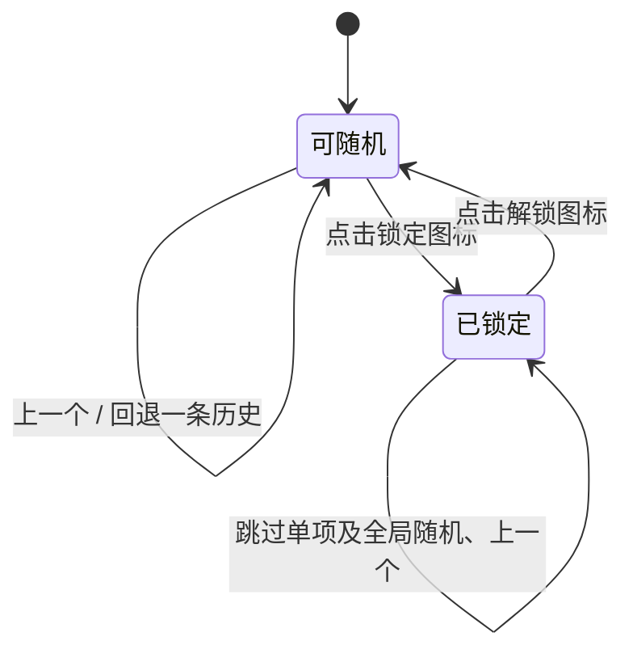

# 搭配

从侧栏或手机菜单进入“搭配”。每个分组可添加多个列表项，分别命名、填写备注，并选择物品、袋子、箱子或柜子。柜子对应现有仓库类型；系统暂存区不参与随机。

分类、标签和规格支持多选。未选维度不限制，三项都不选时从该类型全部档案随机。

| 规则 | 判断方式 |
| --- | --- |
| 包含 | 档案包含全部已选分类、标签和规格，可以有额外选项 |
| 符合 | 每个已选择的维度与档案的选项集合完全一致 |
| 存在 | 分类、标签或规格命中任意一个已选选项 |

有多个候选时，随机避免立即重复当前档案；只有一个候选时保留同一结果。每项最多保留 100 条历史，回退时跳过已永久删除的档案。修改类型或匹配规则会清空该项结果及历史；锁定时不能修改类型和匹配规则。

每项可独立切换“大图 + 简洁详情”和“小图 + 详情”。列表项固定为 376px 高，详情较多时在详情区域滚动，备注过长时截断显示，操作按钮位置保持固定。

分组名称、备注、列表项配置、显示模式、锁定状态、当前结果及历史均保存到数据库。配置停止修改 400ms 后自动保存，随机、回退及切换分组前先完成待保存修改。服务端按用户隔离分组，并通过版本号和请求编号防止覆盖与重复执行。保存失败时保留当前页面草稿，提供重试；若另一页面已更新，可重新加载分组并放弃本地修改。

此功能需要 0.3.0 客户端服务，界面资源包的最低客户端版本为 0.3.0。
