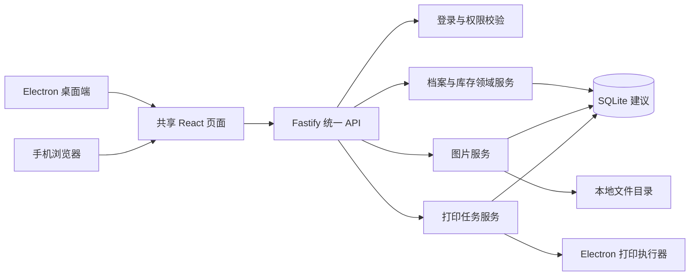
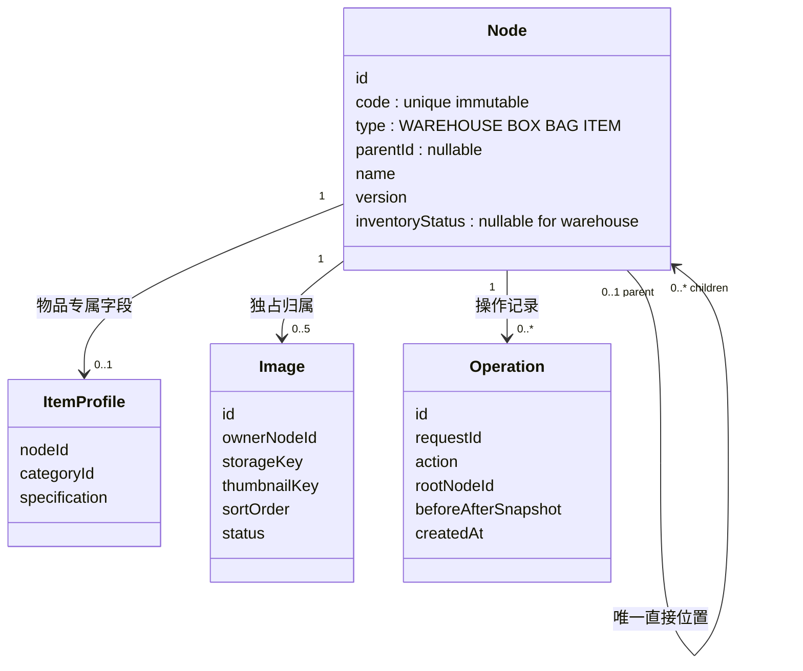
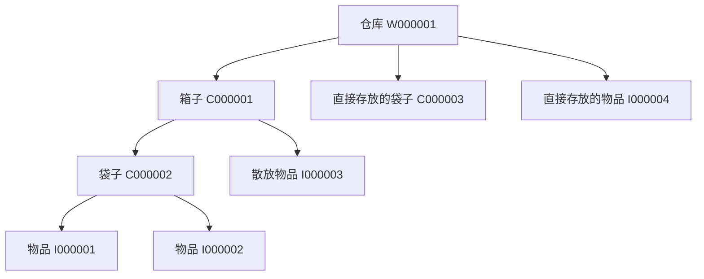
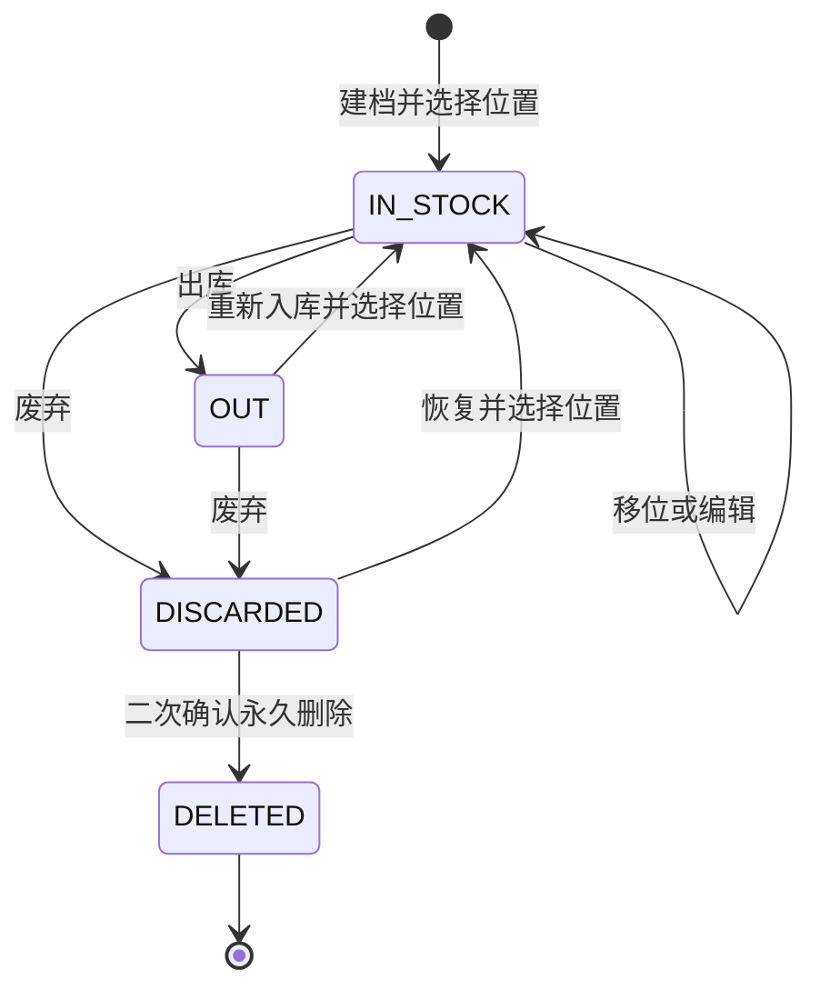
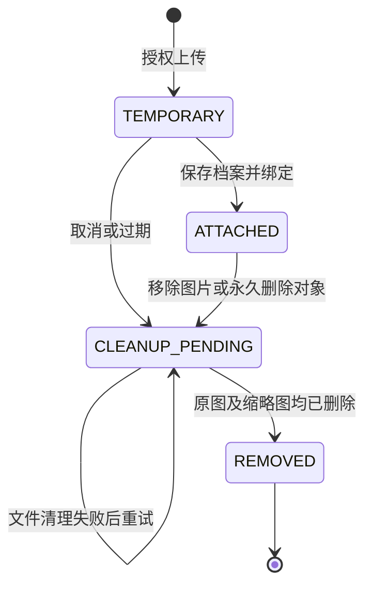
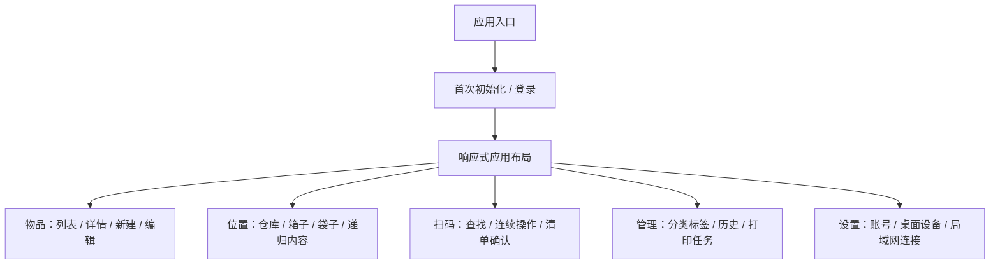
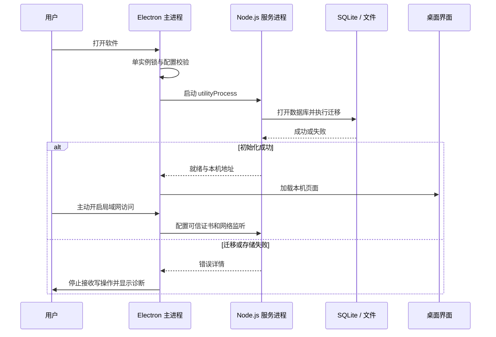
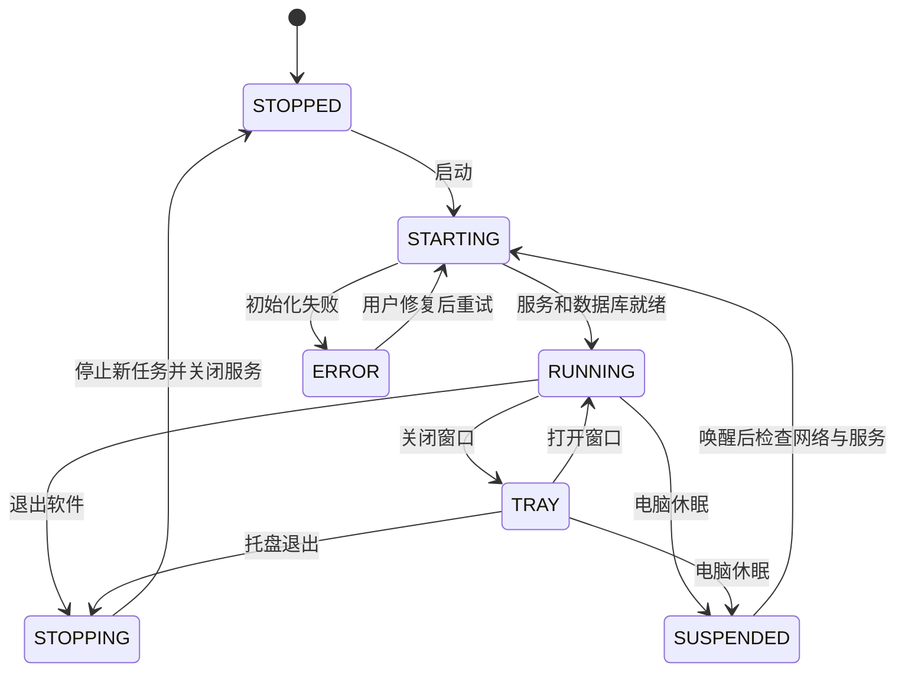
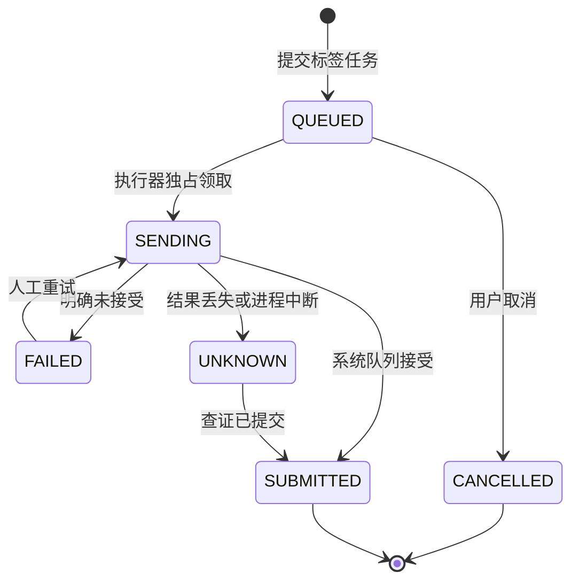

# Inventory Hub 系统设计

日期：2026-09-05。状态：需求汇总与目标架构，尚未进入业务实现。

## 1. 产品定位与决策边界

通用的单件物品管理软件：为每个实体建立独立档案和稳定编号，以仓库、箱子、袋子描述实际存放结构，支持桌面和手机协同操作。

### 1.1 已确认需求

- Electron 独立桌面软件，目标支持 Windows 和 macOS；手机使用局域网网页，不开发原生手机应用。
- 后端使用 Node.js；前端 React + TypeScript + shadcn/ui，一套页面适配 PC 与手机，使用默认组件风格。
- 单用户登录；物品独立编号；入库、出库、移库、档案编辑、废弃及操作记录；支持批量操作。
- 仓库、箱子、袋子、物品有各自的编号。单件物品所在袋子仍使用容器码，不能拿物品码充当容器码。
- 箱子允许混装袋子和散放物品；袋子可包含一件或多件物品；不允许箱套箱、袋套袋、袋装箱。
- 物品或容器只能有一个直接位置，祖先分组通过树推导；仓库可直接放箱子、袋子或物品；未指定时使用默认仓库。
- 扫描仓库或容器后递归展开，保留层级，区分直接存放和间接存放。
- PC 通过扫码枪识别；手机通过摄像头识别；支持连续扫码后批量操作。
- 汉印 HPRT D35 连接电脑，由软件执行打印；手机可提交打印任务，但不直接连接打印机。
- 物品、袋子、箱子、仓库各最多 5 张图片；真正删除实体时清理其图片，避免无归属文件积累。
- 不需要导入、备份或定制 Apple 风格。

### 1.2 本版设计建议，非已批准事实

| 建议 | 原因与影响 |
|---|---|
| Fastify 提供内置 Node.js 服务 | 页面资源和 API 可一起打包，桌面、手机调用一致 |
| SQLite 替代此前的 MySQL | 无需安装数据库服务；此项仍需用户明确确认 |
| Drizzle ORM + better-sqlite3 | 类型化数据访问和迁移；需要验证 Electron 原生依赖打包 |
| 不再依赖本地 Nginx/Docker | 内置服务承担静态文件和 HTTPS，符合安装即用 |
| 永久删除先经过废弃 | 防止正常库存档案被误删，二次确认后不可恢复 |
| 废弃恢复直接回到在库 | 必须重新选择有效位置，不盲目恢复失效旧位置 |
| 批量库存操作整批成功或整批回滚 | 减少部分执行导致的物理位置与系统不一致 |
| 分类为单一树形分类，标签多选 | 分类表达主类目，标签表达跨类属性；容器分类由后代汇总 |

绘图采用上述建议形成可讨论的完整方案。若确认保留 MySQL，需要调整数据访问、安装和进程管理方案，不能直接承诺仍然无外部依赖。此前服务器部署能力保留为后续可独立运行 Node.js 服务的演进方向，不属于首版已交付能力。

## 2. 系统逻辑架构

[交互图：系统架构](diagrams/01-system.html)

桌面只是主入口，不是另一套后端。所有位置变更、编号生成、图片归属和操作历史统一由业务服务处理。界面不能直接修改数据库。系统架构图中“数据库 → 图片”的关系仅表示文件元数据索引，不表示数据库执行磁盘操作；运行时实际文件读写均由服务进程完成。

### 2.1 技术栈

| 模块 | 本版方案 |
|---|---|
| 桌面 | Electron，TypeScript，受限 preload 接口 |
| 前端 | React、Vite、shadcn/ui、Tailwind CSS |
| 前端数据与路由 | React Router、TanStack Query |
| 服务 | Node.js、Fastify、JSON Schema 请求校验 |
| 数据库 | SQLite、better-sqlite3、Drizzle ORM，均为推荐组合 |
| 图片 | Sharp，统一解码、规范化、缩略图和方向处理 |
| 扫码 | PC 键盘式扫码枪；手机 @zxing/browser |
| 标签 | Code 128；JsBarcode 预览；打印实现按真机验证确定 |
| 打包 | Electron Forge，平台原生依赖重建 |
| 工程组织 | pnpm workspace；前端、服务、桌面入口和共享契约分包 |

具体版本在实现前锁定兼容的稳定版本，不使用浮动 latest；Electron 自带的 Node.js 版本是服务依赖兼容性的基线。

## 3. 编号与位置模型

`Node.parentId` 不是任意树：仓库为根且不嵌套；箱子只能放仓库；袋子只能放仓库或箱子；物品可放仓库、箱子或袋子。允许父节点为空的情况只包括根仓库和离库/废弃对象；在库的非仓库对象必须有有效位置。

编号建议为 `W` 仓库、`C` 容器、`I` 物品加至少六位递增序号；箱和袋共用容器号段，具体类型由档案区分。数字位数可增长，编号不包含位置或分类；移动、改名不换号；永久删除后也不复用。内部主键与可打印编号分离，序列分配与建档在同一事务内完成。

物品字段：名称、编号、单一分类、规格键值对、标签、图片、备注及当前路径。容器字段：名称、容器类型、编号、标签、图片、备注；分类列表从后代物品去重汇总，不限制混装。分类可嵌套且不能循环；删除仍被使用的分类必须先迁移归属。

图片表的 `ownerNodeId` 真实外键指向统一节点，不使用难以保证完整性的自由字符串多态归属。每个对象独占图片，不跨对象共用文件；归属上限由事务内校验保证，不能只在前端限制。

## 4. 库存状态与容器操作

[交互图：物品状态](diagrams/02-inventory.html)

图中的“新建物品”是未提交的界面状态，不是额外持久化库存状态。建档成功默认同时入库；没有指定仓库时落入默认仓库，不要求人为增加一次入库操作。

- 入库：纳入当前库存并指定存放位置；重新入库沿用已有编号。
- 移位：在库对象装袋、装箱、拆包、换仓；改变位置，不再次入库。
- 出库：当前库存解除归属，保留编号、档案、图片及最后位置历史。
- 废弃：退出正常库存，保留档案和图片；恢复时选择有效位置。
- 删除：本版建议仅允许从废弃状态永久删除，保留不含图片的操作摘要。

### 4.1 容器与仓库的规则

| 操作 | 设计规则 |
|---|---|
| 整袋或整箱移动 | 更新根容器直接父节点，后代位置由树推导；不逐件伪造人工操作 |
| 整袋或整箱出库 | 同一事务改变容器和后代在库状态；保留内部包含关系，解除根容器仓库归属 |
| 整袋或整箱重新入库 | 选择有效目标位置，同一事务恢复整棵子树；异常后代先解决，不部分成功 |
| 单件从容器出库 | 解除该物品的直接归属，不改变其他内容 |
| 废弃或删除容器 | 必须先移出所有内容；首版不允许连带废弃或删除后代 |
| 删除仓库 | 非默认仓库且为空；需要二次确认，不连带删除内容 |
| 默认仓库 | 系统初始化创建，不允许删除 |

物品和容器有在库、出库、废弃状态；仓库不参与出入库状态机。仓库和空容器的档案删除受额外保护约束。整箱移动记录根操作及后代 ID、原路径快照，单件历史查询要能检索当时影响它的祖先操作，不能只按当前树追溯。

## 5. 连续扫码与事务一致性

[交互图：连续扫码](diagrams/05-scan.html)

扫描会话包含操作类型、锁定目标、已识别列表、去重集合、错误提示和请求标识。扫描不会直接修改库存，用户完成清单后统一确认。

- 扫码枪按专用输入框和结束符采集，不全局吞掉普通表单键盘输入。条码格式可校验；手动输入编号保留为辅助入口。
- 摄像头页面需用户授权，离开页面或暂停时释放视频流；连续识别采用时间窗口和清单双重去重。
- 未知编号、已在目标位置、类型不允许、已废弃、循环位置和同时选中祖先/后代要逐项提示。
- 前端校验只提供反馈；提交时服务端在写事务内重新读取状态、版本与位置关系。
- 批量请求携带唯一 `requestId`，持久化结果；相同 ID 和相同载荷重发返回原结果，不重复执行；相同 ID 不同载荷拒绝。
- 网络超时不等于失败：先查询请求结果，不能重新生成 ID 盲目重试。
- 更新时比较 `version`；同一对象被另一端修改时返回冲突及当前版本，整批回滚并提示重新确认。

## 6. 图片生命周期

文件写入、数据库提交不是同一个事务，需要显式补偿：上传先写临时文件并登记；绑定失败保留为可清理临时项；删除时先在事务内撤销归属和访问权限并保存清理任务，提交后再删磁盘文件。清理进程重启可继续，文件已经不存在视为成功。

每个对象最多 5 张有效图片；支持封面、排序和删除。原图与缩略图都受登录校验，不公开映射整个磁盘目录。校验真实图片格式、文件大小、解码像素上限和路径；去除不必要的定位等元数据。建议初始上传上限为单张 10 MiB、解码像素 40 MP，可在实现时基于设备样本调整。

首版明确支持 JPEG、PNG、WebP；手机相册中的 HEIC 需要平台解码能力验证，未支持时明确提示，不承诺自动可用。摄像头扫码不等于图片档案拍照功能，两者独立实现。

## 7. 前端页面与功能边界

[交互图：前端结构](diagrams/03-pages.html)

| 路由建议 | 页面与主要内容 | 平台 |
|---|---|---|
| `/setup` | 第一次设置本机管理员密码，不暴露网络注册 | 桌面首次运行 |
| `/login` | 单账号登录，失败提示 | 共用 |
| `/items` | 检索、分类/标签/状态/位置筛选、分页、批量选择 | 共用 |
| `/items/new`、`/items/:id/edit` | 名称、规格、分类、标签、最多五图 | 共用 |
| `/items/:id` | 编号条码、图片、当前路径、操作记录、库存动作 | 共用 |
| `/locations` | 仓库与容器位置树，新增仓库/容器 | 共用 |
| `/locations/:id` | 基本档案、直接内容、递归内容、汇总分类、混装操作 | 共用 |
| `/scan` | 单码查询；选择操作和目标后连续扫描 | 扫码入口按平台适配 |
| `/operations` | 操作历史，按对象、动作和时间筛选 | 共用 |
| `/taxonomy` | 分类树与标签管理 | 共用 |
| `/print-jobs` | 提交标签、查看队列、失败和结果待确认 | 共用 |
| `/settings/account` | 修改密码、退出其他会话 | 共用 |
| `/settings/devices` | 打印机、纸张尺寸、扫码枪配置 | 仅桌面 |
| `/settings/lan` | 开关、访问地址、证书指引、防火墙诊断 | 仅桌面 |
| `/settings/about` | 版本、数据目录位置、运行状态 | 桌面 |

PC 使用侧栏和表格；手机使用底部主导航、卡片和抽屉式编辑，不强行缩放桌面表格。保持相同 API 和表单规则。禁止仅按窗口宽度推断是否有 Electron 权限：桌面能力由受限桥接口声明，服务器也必须检查授权。

## 8. 运行时、局域网和安全

[交互图：运行时架构](diagrams/04-runtime.html)

### 8.1 进程职责

- 主进程：窗口、托盘、单实例、服务启停、证书配置、打印执行；不处理库存 SQL。
- 渲染进程：共享 React 页面；`nodeIntegration: false`、`contextIsolation: true`，启用沙箱。业务通过 API 调用；preload 仅暴露白名单系统能力。
- 服务进程：API、静态资源、登录、数据库、图片和持久化任务；作为唯一数据库访问者。崩溃时主进程显示不可用，不继续假装保存成功。
- 打印任务由服务登记，使用内部 IPC 发送给主进程，结果返回服务持久化；不开放任意命令或原始打印指令的网络入口。

> ***“IPC”***
>
> *软件内部不同进程之间的消息通道。页面只能提出明确的业务请求，不能借这条通道随意操作电脑。*

### 8.2 网络与认证

桌面默认使用仅回环监听的本机网页/API；首次密码初始化通过桌面内部授权，不向局域网开放。手机访问由同一服务增加 LAN HTTPS 入口，静态资源与 API 保持同源，两种入口均做登录校验，不以来源为本机代替认证。

- Session 存服务器端，密码使用带盐的安全密码哈希；Cookie 为 HttpOnly、适当的 SameSite，HTTPS 入口启用 Secure；写操作验证 CSRF 和允许的 Origin。
- 手机输入账号密码登录，不将长期凭证放在入口二维码中；退出、改密可撤销会话。
- 用户主动开启 LAN；绑定指定私有网卡并提示系统防火墙授权，不默认暴露所有网卡，不做端口映射。
- 摄像头要求可信 HTTPS。首次生成本地签发机构及服务证书，手机安装信任的是公开证书，私钥不分发。安装前在桌面核对证书指纹；证书信任需要用户明确操作。
- 服务证书覆盖实际访问 IP/主机名；网卡、IP 改变时更新地址和证书，不能继续展示无效入口。
- 仅访问 HTTPS 页面仍不足以保证摄像头可用：还要有浏览器权限、正常摄像头和可信证书链。
- API 进行请求体大小、上传大小、登录频率、路径和输入校验；图片按档案授权读取。
- 拒绝非白名单导航、任意新窗口、任意本机文件访问及来自不可信页面的桥调用。

### 8.3 应用状态

关闭窗口不等于退出；收到托盘后手机可继续访问。退出、休眠、关机或断网时手机不能继续访问，本版不支持手机离线写入。退出时停止新写入，等待当前短事务结束；正在提交的打印任务若无法确定结果，恢复后标为待确认，不自动重打。

## 9. 打印任务设计

[交互图：打印状态](diagrams/06-print.html)

`SUBMITTED` 只表示提交到系统打印队列，不表示设备实际出纸。不把库函数回调成功显示为“打印完成”。如果驱动不提供状态，保留这一边界。

任务记录打印机标识、对象编号、模板版本、纸张尺寸、份数、载荷快照、领取标识和时间。编号稳定，标签上可包含名称；重命名不改变历史任务的打印快照。

首版建议先使用 Electron 本机打印能力加系统驱动，按真实标签设置尺寸、边距与缩放。Code 128 必须保留合适空白区，实际打印后用扫码枪和手机验证。TSPL 原始指令输出可作为硬件适配实现，但并非 Electron 自带的“直接 USB 通用打印”能力，须单独验证。

未知结果不能自动重试。用户查证仍无法判断时，需要明确承认重复打印风险，再创建关联原任务的新任务。已提交系统队列的任务不承诺能由应用可靠取消。

## 10. 数据存储与建议接口

软件用户数据目录中分别存放 `database/`、`media/`、`temporary/`、`certificates/` 和有限保留的 `logs/`。目录独立于安装包，升级替换程序不覆盖数据；不把证书私钥、数据库、图片或日志写入 Git 仓库。按要求不做备份功能，磁盘损坏和永久删除没有自动恢复承诺。

核心表建议：`nodes`、`item_profiles`、`categories`、`tags`、`node_tags`、`images`、`operation_logs`、`operation_targets`、`request_results`、`print_jobs`、`cleanup_jobs`、`users`、`sessions`、`code_sequences`。启用外键和唯一编号约束。SQLite 仅本机磁盘运行；不共享数据库文件给手机或另一台电脑。

| API 建议 | 职责 |
|---|---|
| `POST /api/auth/login`、`POST /api/auth/logout` | 登录与退出 |
| `GET /api/items`、`POST /api/items` | 分页检索、建档并入库 |
| `GET /api/items/:id`、`PATCH /api/items/:id` | 档案查询、带版本更新 |
| `GET /api/nodes/:id/contents?recursive=true` | 返回结构化递归内容，包含直接父节点 |
| `GET /api/codes/:code` | 统一识别仓库、容器或物品 |
| `POST /api/inventory/operations` | 带 requestId 的入库、出库、移位、废弃、恢复 |
| `GET /api/requests/:requestId` | 查询结果不明的操作 |
| `DELETE /api/nodes/:id` | 按类型、状态、内容和版本校验后永久删除 |
| `POST /api/uploads` | 登录后临时上传 |
| `PUT /api/nodes/:id/images` | 原子绑定、排序、封面及解除图片归属 |
| `GET /api/images/:id` | 授权访问原图或缩略图 |
| `POST /api/print-jobs`、`GET /api/print-jobs` | 提交和查询打印任务 |
| `POST /api/print-jobs/:id/retry` | 仅明确失败时人工重试 |
| `POST /api/print-jobs/:id/cancel` | 仅待打印任务可取消 |
| `GET /api/operations` | 分页查询操作历史和当时的影响对象 |

这些是设计契约，不是已存在的接口。分类、标签、仓库和容器的管理接口遵循同样的鉴权、版本和删除保护规则；实现前补齐字段级契约。首版无需 Redis、消息队列或独立图床。

## 11. 打包、平台与后续演进

目标发布 Windows x64 安装程序、macOS ARM64 和 x64 的 DMG；首版分别打包。Windows ARM 和具体最低系统版本不在已确认范围，需结合 Electron 版本锁定。前端和服务共用代码，打印、托盘、目录和证书安装指引按系统适配。

推荐在对应操作系统构建并运行安装包检查；better-sqlite3 与 Sharp 必须匹配目标架构及 Electron 环境，不能把开发机的依赖直接复制到其他平台。个人自用可先不办理正式发行签名，但需说明系统拦截和手动信任成本；公开发行应配置签名，macOS 还需公证。

Node.js 业务层不导入 Electron，后续可独立启动在服务器上；桌面可演进为远程 API 客户端与本机打印执行器。此时只选一个权威服务端，不默认设计双向同步。服务器部署、迁移和远程安全配置是后续工程，不声称本版已实现。

## 12. 验收清单

以下为未来实现的验收标准，不是本次已经执行的软件测试；本次仅验证架构文档及图形产物。

| 编号 | 场景 | 预期 |
|---|---|---|
| AC-01 | 全新机器安装 | 无需另装 Node.js/数据库服务；首次设置可完成 |
| AC-02 | 创建多个物品与容器 | 编号唯一、不因移动改变、不重复利用 |
| AC-03 | 仓库内混装 | 扫码递归显示袋子及散放物品，路径正确 |
| AC-04 | 非法嵌套与循环 | 服务端拒绝；数据库、日志均无部分变更 |
| AC-05 | 单件袋子 | 保留袋子容器码及物品独立码 |
| AC-06 | 连续扫码重复识别 | 清单去重，重复请求不重复执行 |
| AC-07 | 双端同时修改 | 版本冲突可见，不静默覆盖 |
| AC-08 | 整箱出入库与移动 | 子树一致，单件历史可追溯祖先操作 |
| AC-09 | 图片限制与回收 | 每类对象最多五张；临时及删除文件可重启清理 |
| AC-10 | 废弃、恢复、删除 | 图片保留/移除语义符合状态图，默认仓库受保护 |
| AC-11 | 手机 LAN 扫码 | 可信 HTTPS、权限允许后可连续识别；拒绝权限有提示 |
| AC-12 | 打印结果不明 | 不自动重发，不误显示为实际打印完成 |
| AC-13 | D35 真机打印 | 对应系统驱动、纸张尺寸正确，手机与扫码枪都可识别 |
| AC-14 | 托盘、退出、休眠 | 手机可用性与运行状态一致，无假成功写入 |
| AC-15 | 安装包跨平台 | Windows、Mac 两种架构分别验证启动、数据库、图片和网络 |
| AC-16 | 安全边界 | 未登录不能读取图片或写库存；网页无法调用任意系统命令 |

## 13. 待确认与待验证

1. 是否正式采用 SQLite，替代原 MySQL + Docker 要求。
2. 实际用于打印的电脑系统版本、CPU 架构及 D35 接口；Mac 打印兼容性不能由软件跨平台能力推导。
3. 标签纸宽高、间隙/黑标类型、每张标签所需字段。
4. 手机系统、浏览器版本，以及是否接受首次安装并信任局域网证书。
5. 本版建议的“先废弃后删除”“恢复时重新选位置”和批量整批事务规则，在开发前确认。

上述事项不阻止本轮输出设计文档，但阻止把对应部分宣称为已最终选定或通过硬件验收。

## 14. 技术参考

- [Electron utilityProcess](https://www.electronjs.org/docs/latest/api/utility-process)：内置 Node.js 子进程。
- [Electron 原生模块](https://www.electronjs.org/docs/latest/tutorial/using-native-node-modules)：跨平台构建要求。
- [Electron 安全指南](https://www.electronjs.org/docs/latest/tutorial/security)：上下文隔离及权限边界。
- [Fastify 服务](https://fastify.dev/docs/latest/Reference/Server/)：HTTP/HTTPS 监听。
- [SQLite 适用场景](https://www.sqlite.org/whentouse.html)：嵌入式数据库与访问方式。
- [Drizzle SQLite](https://orm.drizzle.team/docs/sqlite/get-started-sqlite)：驱动与迁移选型参考。
- [浏览器摄像头要求](https://developer.mozilla.org/en-US/docs/Web/API/MediaDevices/getUserMedia)：可信上下文与授权。
- [Electron 打印 API](https://www.electronjs.org/docs/latest/api/web-contents/#contentsprintoptions-callback)：指定打印机与队列提交。
- [HPRT D35 官方参数](https://www.hprt.com.cn/ChanPin/255.html)：打印协议与接口，不能据此保证 Mac 驱动。

参考资料支持设计依据，不替代实际硬件验证；最终依赖版本和 API 行为需在实现时按锁定版本复核。
